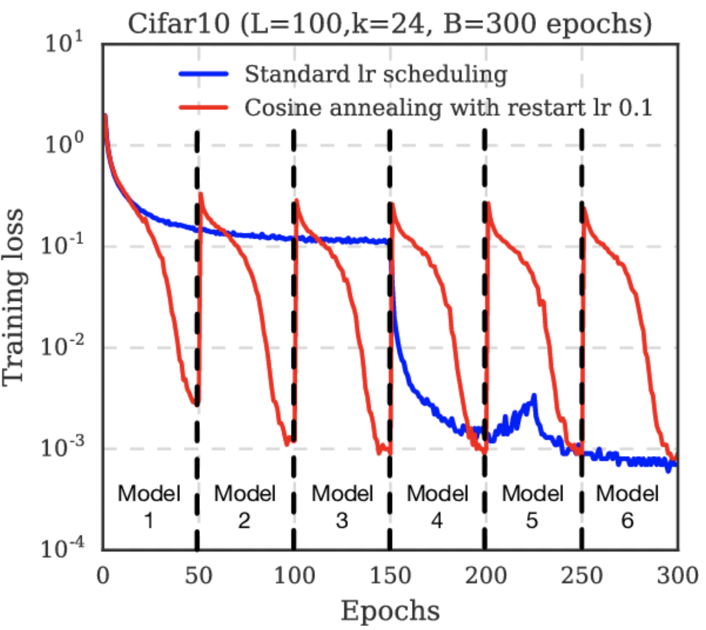

# 学习率和Cosine Learning Rate Schedule

## 学习率为什么重要

学习率需要在收敛和过火之间权衡。学习率太小，则收敛得慢。学习率太大，则损失会震荡甚至变大。

不同学习率的影响就像：

学习率可能是最重要的参数了。如果你只有时间调整一个参数，那么就是学习率。

学习率还会跟优化过程的其他方面相互作用，这个相互作用可能是非线性的。小的batch size最好搭配小的学习率，因为batch size越小也可能有噪音，这时候就需要小心翼翼地调整参数。

## 训练过程中调整学习率

训练过程中调整学习率的意思是，在训练过程中，根据训练的火候，适当增加或减小学习率。调整学习率的目的是尽快收敛到较优值（同时满足快和优）。一般来说，调整学习率实际上都是减少学习率，因此有的地方也叫学习率衰减(decay)或学习率退火(annealling)。调整学习率主要有两类方法：学习率schedule和自适应学习率。学习率schedule根据一定的公式调整学习率，公式中学习率是训练步数的函数；自适应学习率是算法自动根据训练中的实际情况，调整学习率。

## Cosine Learning Rate Schedule
也叫Cosine Annealing。

Cosine Annealing是一种学习率schedule方法，它的效果是从一个较大的学习率开始，然后相对快速地减少到一个最小值，再快速增加到一个较高的值。这个学习率的重置类似于对学习过程的模拟重启。

具体来说，Cosine Annealing的学习率调度方式通常遵循余弦函数的变化模式。例如，在一个周期内，学习率 $\eta(t)$ 会按照下列公式变化：

$$
\eta_t = \eta_{\min} + \frac{1}{2} (\eta_{\max} - \eta_{\min}) \left(1 + \cos\left(\frac{T_{cur}}{T_{max}} \pi\right)\right)
$$

其中：
- $\eta_t$ 是在第 $t$ 次迭代时的学习率。
- $\eta_{\max}$ 是初始学习率的最大值。
- $\eta_{\min}$ 是学习率的最小值（通常设为0）。
- $T_{cur}$ 是当前迭代次数。
- $T_{max}$ 是总的迭代次数。

举例一个Cosine Annealing曲线：

*参考资料* 
- [Cosine Annealing](https://paperswithcode.com/method/cosine-annealing)
- [Wikipedia Learning rate](https://en.wikipedia.org/wiki/Learning_rate) 
- [cs231n](https://cs231n.github.io/neural-networks-3/)
- [Deep Learning, Chpater 11](https://www.deeplearningbook.org/contents/guidelines.html), 424页 
- [How to Configure the Learning Rate When Training Deep Learning Neural Networks](https://machinelearningmastery.com/learning-rate-for-deep-learning-neural-networks/) 
- [SGDR: Stochastic Gradient Descent with Warm Restarts](https://arxiv.org/abs/1608.03983) 
