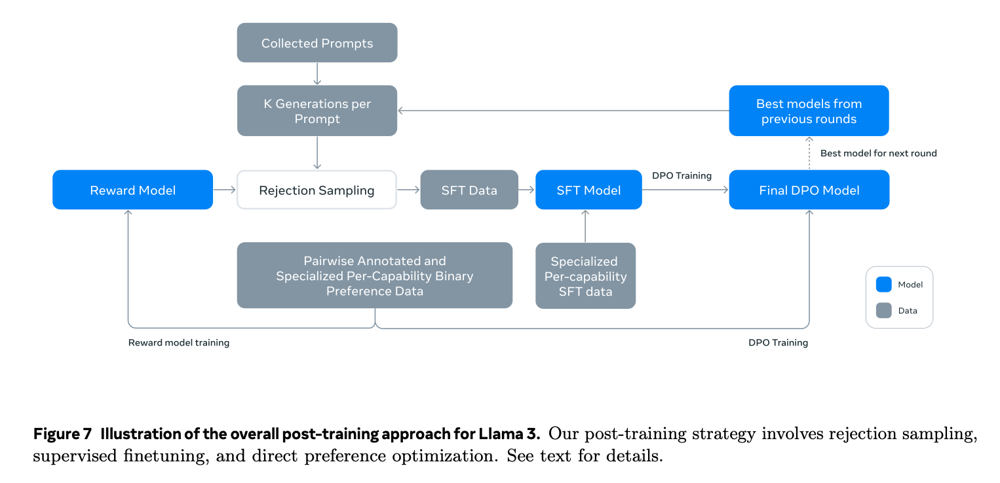

# Llama 3 Post-Training

Post-Training是Llama 3训练的重头戏，决定了模型的上限。

> We produce the aligned Llama 3 models by applying several rounds of post-training, or aligning the model with human feedback on top of a pre-trained checkpoint. Each round of post-training involves supervised finetuning (SFT) followed by Direct Preference Optimization (DPO) on examples collected either via human annotations or generated synthetically.

> The backbone of our post-training strategy is a reward model and a language model. We first train a reward model on top of the pre-trained checkpoint using human-annotated preference data. We then finetune pre-trained checkpoints with SFT, and further align the checkpoints with DPO.

## Reward Modeling
RM在这里是用来挑选答案的，不是用来训练RLHF的。

> The training objective is the same as Llama 2 except that we remove the margin term in the loss, as we observe diminishing improvements after data scaling. 

> The reward model takes a model response and its corresponding prompt (including contexts from previous turns) as inputs and outputs a scalar score to indicate the quality (e.g., helpfulness and safety) of the model generation. 

有用和安全需要权衡，于是训练了两个RM，一个是Helpfulness RM， 一个是Safety RM。

RM初始化为预训练后的模型。模型的结构和超参数都和预训练模型相同，except that the classification head for next-token prediction is replaced with a regression head for outputting a scalar reward.

To train the reward model, we convert our collected pairwise human preference data into a binary ranking label format (i.e., chosen & rejected) and enforce the chosen response to have a higher score than its counterpart. We used a binary ranking loss:

$$
L_{\text{ranking}} = -\log(\sigma(r_{\theta}(x, y_c) - r_{\theta}(x, y_r)))
$$

where $r_{\theta}(x, y)$ is the scalar score output for prompt $x$ and completion $y$ with model weights $\theta$. $y_c$ is the preferred response that annotators choose and $y_r$ is the rejected counterpart.

In addition to standard preference pair of (chosen, rejected) response, annotations also create a third “edited response” for some prompts, where the chosen response from the pair is further edited for improvement. Hence, each preference ranking sample has two or three responses with clear ranking (edited > chosen > rejected). We concatenate the prompt and multiple responses into a single row during training with responses randomly shuffled. This is an approximation to the standard scenario of putting the responses in separate rows and computing the scores, but in our ablations, this approach improves training efficiency without a loss in accuracy.

数据构造略。

原文这里有地方没说清楚。前面说RM takes a model response and its corresponding prompt (including contexts from previous turns) as inputs and outputs a scalar score， 后面又说 We concatenate the prompt and multiple responses into a single row during training with responses randomly shuffled，那么优化目标是什么呢？还是上面那个公式吗？还有，edited response是怎么利用的？

In each round of post-training, we use all the preference data that is available at the time for reward modeling, while only using the latest batches from various capabilities for DPO training. For both reward modeling and DPO, we use samples that are labeled as the chosen response being significantly better or better than the rejected counterpart for training and discard samples with similar responses.

## Supervised Finetuning

SFT的训练部分没有什么特殊的，we finetune the pre-trained language model using a standard cross entropy loss on the target tokens (while masking loss on prompt tokens)。

SFT的关键是数据的构建，详见[Llama3 SFT的数据构建](llm_foundation/llama3/llama3_sft_data.md)。

## Direct Preference Optimization
For training, we primarily use the most recent batches of preference data collected using the best performing models from the previous alignment rounds.

In addition, we apply the following algorithmic modifications to DPO:
- Masking out formatting tokens in DPO loss. We hypothesize that this is due to the contrastive nature of the DPO loss – the presence of common tokens in both chosen and rejected responses leads to a conflicting learning objective as the model needs to increase and reduce the likelihood of these tokens simultaneously.
- Regularization with NLL loss. This helps further stabilize DPO training. 

## Model Averaging
Finally, we average models obtained from experiments using various versions of data or hyperparameters at each RM, SFT, or DPO stage. 

## Iterative Rounds
Following Llama 2, we apply the above methods in six rounds. In each cycle, we collect new preference annotations and SFT data, sampling synthetic data from the latest models.

回到开头的两段话，这里将所有东西串联起来。

模拟一下6个round：
- Round 1
    - 步骤1：奖励模型训练
        - 数据准备：收集初始的人类偏好数据，标注一些提示及其对应的响应（包括选择的、拒绝的和编辑后的响应）。
        - 模型训练：使用这些数据训练奖励模型（Helpfulness RM和Safety RM），初始化为预训练后的模型。
    - 步骤2：SFT
        - 数据准备：收集初始的SFT数据集，包含高质量的人类标注文本。
        - 模型微调：使用标准的交叉熵损失对预训练语言模型进行微调。
    - 步骤3：DPO
        - 数据准备：从最新的SFT模型中采集一些偏好数据（详见附录1）。
        - 模型优化：使用最新的偏好数据进行DPO训练，应用屏蔽格式化标记和NLL损失正则化。
- Round 2
    - 步骤1：奖励模型训练
        - 数据准备：收集更多的偏好数据，包括新的提示及其响应。
        - 模型训练：使用新的数据再次训练奖励模型。此时，模型会利用第一轮中学到的权重进行初始化。
    - 步骤2：SFT
        - 数据准备：收集更多的SFT数据集，新的RM在这里起作用。
        - 模型微调。
    - 步骤3：DPO
        - 数据准备：从新的SFT模型中采集更多的偏好数据。
        - 模型优化。
- Round 3 ~ Round 6
    - 以此类推
- 在每一轮结束后，对不同数据版本和超参数设置下得到的模型进行平均，确保最终模型的稳定性和高性能。

## 附录
### 附录1 从最新的SFT模型中采集偏好数据
在DPO中，从最新的SFT模型中采集偏好数据的意思是利用最新经过SFT微调后的模型生成新的响应，并使用这些响应来构建偏好数据集。具体步骤如下：
1. **生成响应**：
    - 使用最新的SFT模型对一组新的或现有的提示（prompts）进行生成任务。SFT模型已经经过多轮微调，具有较好的生成能力。
    - 对每个提示，生成多个不同的响应（outputs），这些响应将用于偏好评估。
2. **人工评估**：
    - 将生成的响应交给人类评估者进行评估。评估者会根据响应的质量、相关性、帮助性和安全性等标准对响应进行排序。
    - 标注出每个提示下的“选择的响应”（chosen response）和“拒绝的响应”（rejected response），有时也会有“编辑后的响应”（edited response）。
3. **构建偏好数据集**：
    - 使用人工评估的结果构建新的偏好数据集。这些数据集包含提示和对应的多个响应（包括选择的、拒绝的和可能的编辑后的响应）。
    - 确保这些数据集有明确的偏好标签（例如，选择的响应优于拒绝的响应）。
4. **DPO训练**：
    - 使用新构建的偏好数据集对模型进行DPO训练。DPO的目标是优化模型，使其生成的响应更符合人类的偏好。
    - 在DPO训练过程中，应用特定的算法修改（如屏蔽格式化标记和NLL损失正则化）以提高训练效果和稳定性。

为什么从最新的SFT模型中采集偏好数据？
- **提升数据质量**：最新的SFT模型生成的响应质量通常较高，这些响应更接近实际应用场景中的高质量回答。
- **反映最新模型能力**：通过使用最新SFT模型生成的响应，可以更准确地反映出模型当前的能力和不足之处，这对于进一步优化非常重要。
- **保持模型一致性**：每一轮训练后，模型都会有所改进。使用经过最新SFT训练的模型生成的数据可以确保训练数据与模型的当前状态更匹配，从而提高训练效果。