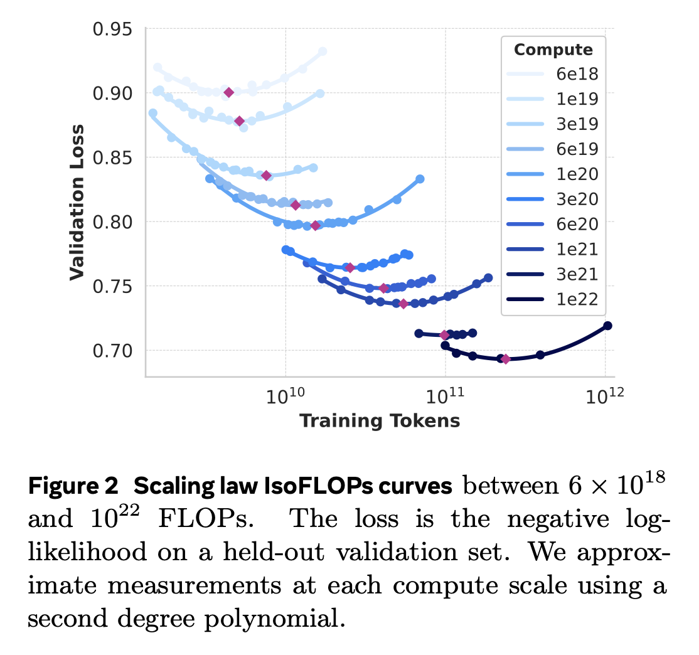
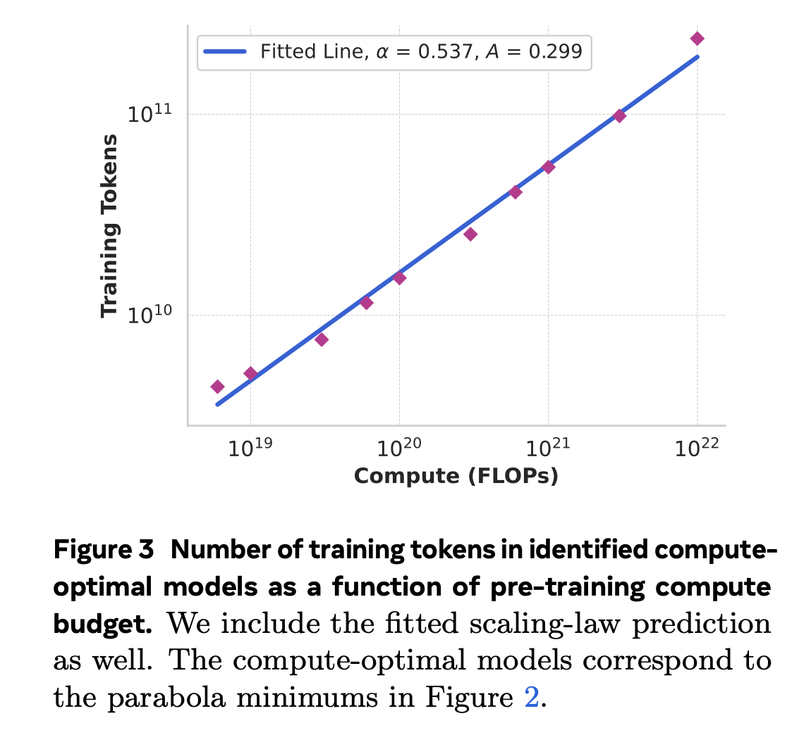

# Llama3 Scale Law
> We train a model at far larger scale than previous Llama models: our flagship language model was pre-trained using 3.8 × 10^{25} FLOPs, almost 50× more than the largest version of Llama 2. Specifically, we pre-trained a flagship model with 405B trainable parameters on 15.6T text tokens. As expected per scaling laws for foundation models, our flagship model outperforms smaller models trained using the same procedure. While our scaling laws suggest our flagship model is an approximately compute-optimal size for our training budget, we also train our smaller models for much longer than is compute-optimal. The resulting models perform better than compute-optimal models at the same inference budget. We use the flagship model to further improve the quality of those smaller models during post-training.

> We develop scaling laws to determine the optimal model size for our flagship model given our pre-training compute budget. In addition to determining the optimal model size, a major challenge is to forecast the flagship model’s performance on downstream benchmark tasks, due to a couple of issues: (1) Existing scaling laws typically predict only next-token prediction loss rather than specific benchmark performance. (2) Scaling laws can be noisy and unreliable because they are developed based on pre-training runs conducted with small compute budgets.

> To address these challenges, we implement a two-stage methodology to develop scaling laws that accurately predict downstream benchmark performance:
> 1. We first establish a correlation between the compute-optimal model’s negative log-likelihood on downstream tasks and the training FLOPs.
> 2. Next, we correlate the negative log-likelihood on downstream tasks with task accuracy, utilizing both the scaling law models and older models trained with higher compute FLOPs. In this step, we specifically leverage the Llama 2 family of models.
> 
> This approach enables us to predict downstream task performance given a specific number of training FLOPs for compute-optimal models. 

实验：在一个FLOPs范围内，训练各个大小的模型。然后，画出IsoFLOPs曲线。"Iso"来自希腊语，意思是“相同”或“等同”。IsoFLOP是指在给定的计算预算下，比较不同模型或实验结果的一种方法。

用抛物线拟合实验值，抛物线的最低点，视为给定计算预算下的compute-optimal模型。

然后，再用compute-optimal models预测特定计算预算下的最优训练token数。做法是，假设计算预算 $C$ 和最佳token数 $N^{*}(C)$ 之间是幂率关系：
$$
N^{*}(C) = AC^{\alpha}
$$

用Fig 2中的数据拟合这个公式，得到 $(\alpha, A) = (0.53, 0.29)$，曲线如下：

将$3.8 × 10^{25}$代入，得到402B参数模型和16.55T token数。
