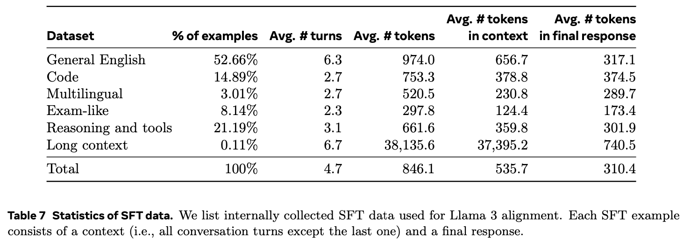

# Llama3 的SFT数据构建方法

> Our finetuning data is largely comprised of the following sources:
> - Prompts from our human annotation collection with rejection-sampled responses
> - Synthetic data targeting specific capabilities
> - Small amounts of human-curated data 

## Rejection sampling

这种方法的核心思想是不断生成候选样本并拒绝那些不符合目标分布要求的样本，直到得到一个符合要求的样本。由于这个方法在每次生成候选样本后都会通过某种标准来决定是否接受该样本，所以称之为“拒绝采样”。

在拒绝采样过程中，每个通过人类标记收集到的prompt会生成K个输出（通常在10到30之间），这些输出来自最新的模型策略（通常是从前一次训练迭代中表现最好的checkpoint，或者是某个特定能力表现最好的checkpoint）。然后，使用奖励模型选择最好的候选输出。

在后续的训练轮次中，引入系统提示来引导拒绝采样的响应，确保其符合期望的语气、风格或格式，不同能力可能有不同的要求。系统提示与实际提示一起输入模型。例如，如果用户的实际提示是“我如何重置密码？”，系统提示可以是“请使用友好且礼貌的语气回复客户的询问”。

详细步骤：

1. 输入Prompt：假设我们有一个提示“如何重置密码？”。
2. 生成候选响应：模型生成多个响应，例如：
    - 响应1：“请点击设置，然后选择重置密码。”
    - 响应2：“你可以通过邮件找回你的密码。”
    - 响应3：“访问用户中心，选择‘忘记密码’，然后按照提示操作。”
3. 评估候选响应：使用奖励模型对这些响应进行评分。
    - 响应1得分：0.8
    - 响应2得分：0.6
    - 响应3得分：0.9
4. 选择最佳响应：选择得分最高的响应，即响应3：“访问用户中心，选择‘忘记密码’，然后按照提示操作。”
5. 形成 (Prompt, Response) 对：最终输出的是 (prompt, response) 对：
    - 提示：“如何重置密码？”
    - 响应：“访问用户中心，选择‘忘记密码’，然后按照提示操作。”

## 数据配比

    

> In each round of post-training, we adjust our overall data mix carefully across these axes to tune performance across a wide range of benchmarks. Our final data mix epochs multiple times on some high quality sources and downsamples others.

## 数据处理和质量控制
基于模型，去掉低质量数据，包括：
- 话题分类。微调finetune Llama 3 8B作为话题分类器。
- 质量打分。
    - RM判高分的认为高质量。
    - 让Llama 3 checkpoint给数据打分，打分高的认为高质量。
    - 如果RM和Llama 3的判断有冲突，任意一个判为高质量，则认为是高质量。
- 难度打分。
    - 通过 Llama 3 70B 模型对 SFT prompt 进行意图标注。一个样本包含的意图越多，其复杂性就越高。
    - 直接让Llama 3判断数据的难度。
- 语义去重。基于RoBERTa进行聚类，在每个簇中，根据quality score × difficulty score排序。遍历每个样本，如果和已遍历的样本的相似度的最大值小于阈值，就留着。

## 各项能力

> We highlight special efforts to improve performance for specific capabilities such as code, multilinguality, math and reasoning, long context, tool use, factuality, and steerability.

### 代码

首先，在代码数据上继续预训练，得到一个code expert模型。

然后，用code expert生成2.7M条合成数据，这是关键。
- 首先，进行常规的问题生成和答案生成。给定模型代码片段，让它生成相关的问题。然后，让模型生成答案。We observe that adding general rules of good programming to the prompt improves the generated solution quality. Also, we find it is helpful to require the model to explain its thought process in comments.
- 用静态分析和单元测试，初步判定答案的正确性。如果有错误，把原问题、错误答案、错误提示都给模型，让它修改。只有没问题的数据才加入到最终的SFT数据。这就叫**execution feedback**。

最后，是数据的过滤和筛选。有之前提到的rejection sampling，还有一个model-as-judge方法。在model-as-judge方法中，用Llama 3的早期版本对代码进行评估，并根据两个标准（代码正确性和代码风格）打分，分数为二进制（0/1）。只有那些在这两个标准上都获得满分（2分）的样本才会被保留。最初，这种严格的筛选导致了下游基准测试性能的下降，主要原因是它不成比例地移除了带有挑战性提示的示例。为了应对这一问题，有策略地修改了一些被分类为最具挑战性的编码数据的响应，直到它们符合Llama-based“model-as-judge”的标准。通过改进这些具有挑战性的问题，编码数据在质量和难度之间达到了平衡，从而实现了最佳的下游性能。

### 多语言
和代码类似，略。

### 数学和推理
列举了数学推理的难点，以及是怎么解决的，略。

### 长上下文
SFT数据中加入长上下文数据是必要的。但是长上下文人工标记不现实，所以要寄希望于合成数据。原文详细介绍了如何生成长上下文的合成数据，略。

### 工具使用
**数据收集** 主要使用人类标注和偏好数据。有两点和前面的方法不太一样：
- 对于工具来说，一个对话通常会包含多个助手消息。
    - 这些消息可能包括调用工具的请求和对工具输出的推理。标注是在消息级别进行的。也就是说，标注员需要对每条助手消息进行评价，而不是对整个对话进行整体评价。
    - 标注员会在相同上下文中，对比两条助手消息，并提供偏好。如果这两条消息都有重大问题，则标注员会编辑其中一条消息。
    - 被选择或编辑过的消息会被添加到对话上下文中，然后对话继续进行。这种方法可以确保每一步的改进都被累积到对话中，从而不断提高助手的表现。
    - 通过这种方法，标注员能够为助手在调用工具和对工具输出进行推理的能力提供人类反馈。这种反馈对于改进助手的性能至关重要。
- 没用rejection sampling，因为发现对工具没有作用。

**工具数据集** 步骤如下：
- 单步工具使用。
    - 生成用户Prompts的初始集合。通过Few-shot generation生成一个合成的用户提示集合。这些提示在设计时就要求调用某些核心工具。例如，涉及超出知识截止日期的问题。
    - 生成工具调用。使用Few-shot generation，为这些用户提示生成适当的工具调用。例如，如果用户提示是关于某个超出模型知识截止日期的问题，模型会生成调用最新知识库的请求。
    - 执行工具调用并添加输出。生成的工具调用被执行，工具返回相应的输出。例如，如果调用的是一个知识库查询工具，工具会返回最新的信息。这个工具输出被添加到模型的上下文中，以便后续步骤可以利用这些信息。
    - 生成最终答案。通过再一次提示模型，基于工具的输出生成最终的用户答案。
    - 数据集过滤。约移除30%的数据。这些被移除的数据可能是由于工具调用无法执行或其他格式问题导致的。
    - 最终得到的轨迹形式：System Prompt, User Prompt, Tool Call, Tool Output, Final Answer。
- 多步工具使用。和单步类似，只不过变成了多步。
- 文件上传。基于上传的文件， 回答相关问题，略。

**Zero-shot tool use data** Zero-shot指模型能够在未见过的工具上进行函数调用。略。

### 真实性(Factuality)
真实性问题不仅仅限于幻觉，然而幻觉是较为直接和突出的错误类型，所以这里从幻觉入手(hallucination-first approach)。

这里用的方法是调整模型的回答，使其知道自己知道什么，而不是添加新的知识。

方法是知识探测(knowledge probing technique)，具体步骤如下：
1. 从预训练数据中提取数据片段
2. 通过提示Llama 3生成关于这些片段的问题。
3. 对生成的问题，让Llama 3回答，然后采样。
4. 将生成的回答与原始数据片段进行比对，并由Llama 3来判断这些回答的正确性。
5. 由Llama 3评估回答的内容是否具有足够的信息量。
6. 对于多次生成中都信息丰富但错误的回答，通过Llama 3生成一个refusal，refusal指的是模型拒绝回答某个问题的行为或机制。通过拒绝回答，模型可以避免在不确定的情况下生成可能误导用户的不准确信息。

通过这个知识探测技术生成的数据，模型被鼓励在其确实有知识的问题上进行回答，而对于不确定的问题则拒绝回答。

另外，预训练数据也不总是事实正确的，特别是在处理敏感话题时。因此，还需要收集一小部分标注过的事实性数据，专门用于处理那些容易出现事实矛盾或错误陈述的敏感问题。

### 可控性(Steerability)
可控性是指将模型的行为和结果导向符合开发者和用户需求的能力。对于像Llama 3这样的基础模型来说，应该具备极强的可控性，以便轻松适应不同的下游应用场景。

在Llama 3的开发中，我们通过系统提示和自然语言指令来增强其可控性，特别是针对响应的长度、格式、语气和角色/个性等方面进行调整。这意味着开发者和用户可以通过指定的指令来精确控制模型的输出，使其更符合特定的需求和期望。

具体做法略。

