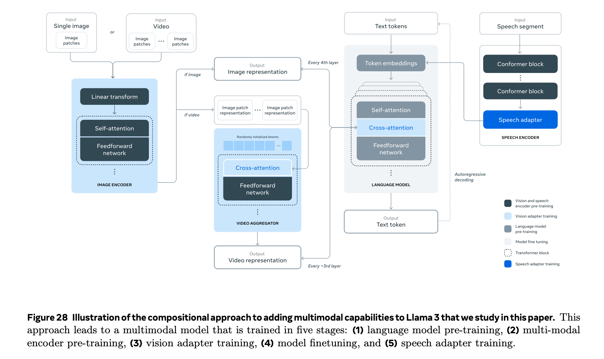

# Llama3多模态之视觉

这里只分析模型结构。

## Image encoder
Image encoder采用ViT-H/14的变种，$16 \times 16$ 个patch，每个patch 7680维。Image encoder的参数在后面的训练中参与调整。

## Image adapter
> We introduce cross-attention layers between the visual token representations produced by the image encoder and the token representations produced by the language model. The cross-attention layers are applied after every fourth self-attention layer in the core language model. The cross-attention layers introduce substantial numbers of additional trainable parameters into the model: for Llama 3 405B, the cross-attention layers have ≈100B parameters.

Cross-attention的本质特征是q和kv来自不同的来源。在这里，每4层施加一个cross-attention，意思是query来自输入文本特征，kv来自视觉特征。

## Video adapter
每个视频均匀采样64帧，每帧先经过image encoder计算，那么每个视频就得到 $64 \times (16 \times 16=256) \times 7680$ 的多维特征。

Video adapter的作用是将 $64 \times 256 \times 7680$ 的时序特征转化成和图片一样的 $256 \times 7680$ 形状。

将时序特征合并为一个特征的组件叫temporal aggregator，具体来说是perceiver resampler。

Perceiver resampler来自flamingo模型，大致结构如下：

图中的latent array，对应最上面Figure 28中的random initialized latents，latent array在cross attention中充当query，它的权重随机初始化，参与训练。

原文中还提到，temporal aggregator将32个连续的帧合并为1个，那64个帧就合并为2个帧，然后呢？拼接还是求平均？原文没有说清楚。

