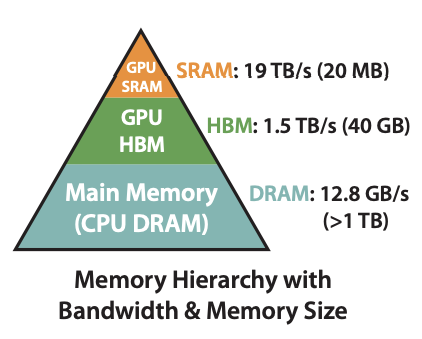
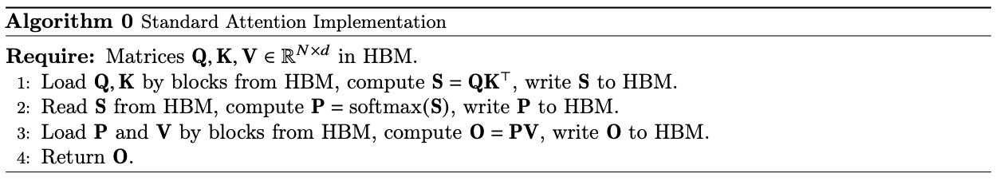
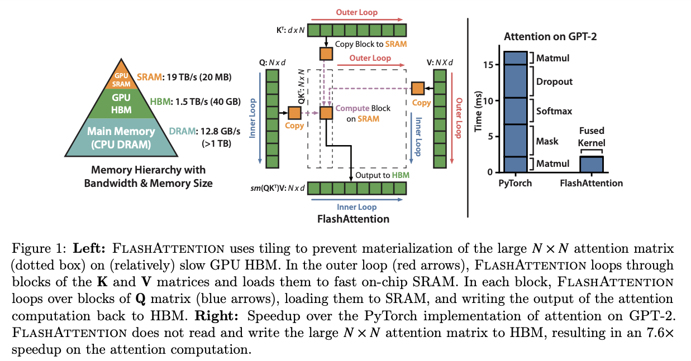
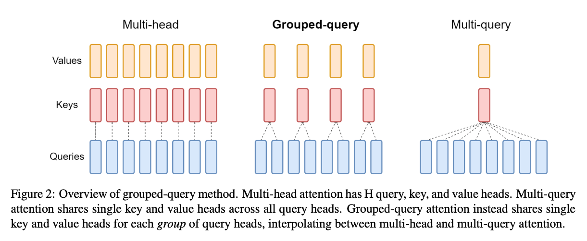
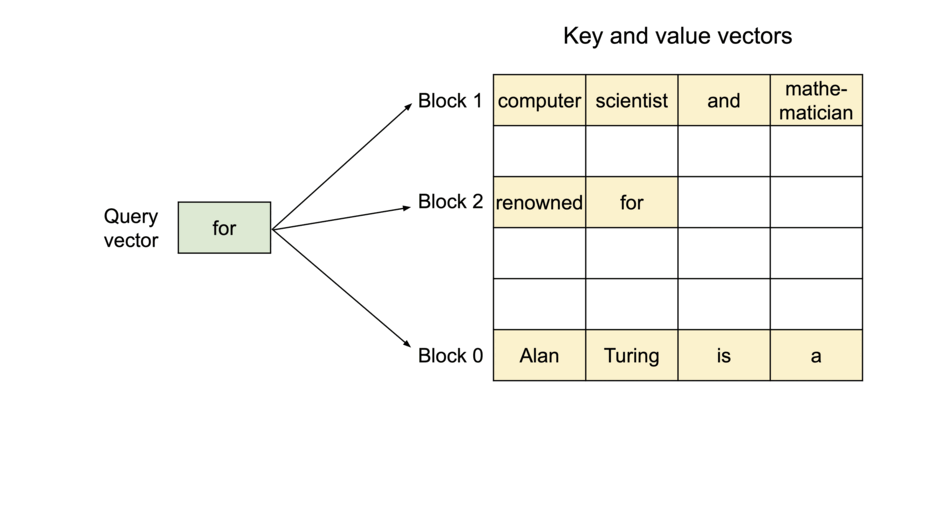
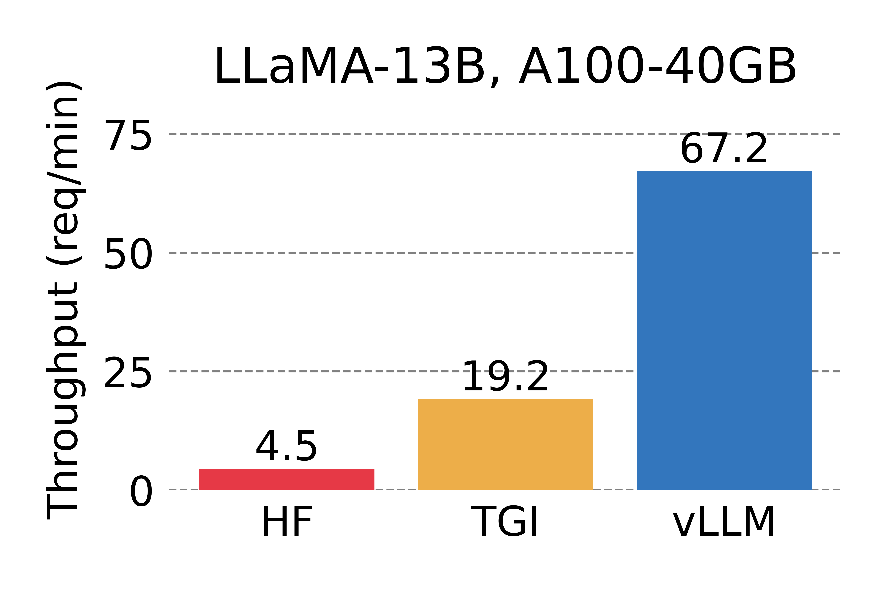

# 大模型中的Attention

## 原始Multi-head Self-attention

### Self-attention公式

Self-attention有 $h$ 个头，每个头的输出拼接后作为多头注意力(MHA)的输出。

每个注意力头的输入是 $n$ 个元素的序列 $x=\left(x_1, \ldots, x_n\right)$ ，$x_i \in \mathbb{R}^{d_x}$。输出新的序列 $z=\left(z_1, \ldots, z_n\right)$  ， $z_i \in \mathbb{R}^{d_z}$ 。
每个输出元素 $z_i$ ,  是线性变换后的输入元素的加权和：
$$
z_i=\sum_{j=1}^n \alpha_{i j}\left(x_j W^V\right) \tag{1}
$$

每个权重系数 $\alpha_{i j}$ , 使用softmax函数计算:

$$
\alpha_{i j}=\frac{\exp e_{i j}}{\sum_{k=1}^n \exp e_{i k}}
$$

$e_{i j}$通过兼容函数计算:

$$
e_{i j}=\frac{\left(x_i W^Q\right)\left(x_j W^K\right)^T}{\sqrt{d_z}} \tag{2}
$$

线性变换可以增加输入的表现能力。$W^Q, W^K, W^V \in \mathbb{R}^{d_x \times d_z}$ 是参数矩阵。这些参数矩阵每一层以及每个头都不同。

### MHA代码实现

[参考](https://machinelearningmastery.com/how-to-implement-multi-head-attention-from-scratch-in-tensorflow-and-keras/)

```python
import torch.nn as nn 
import torch
import torch.nn.functional as F

class ScaledDotProductAttention(nn.Module):
    def forward(self, q, k, v, mask=None):
        """
        Args:
          q, k, v: shape(batch, num_heads, seq_len, d_k)
        Returns:
          shape(batch, num_heads, seq_len, d_k)
        """
        k = k.permute(0,1,3,2)
        scores = torch.mutmul(q,k) # shape(batch, num_heads, seq_len, seq_len)
        d_k = k.size(-1)
        scores = scores / (d_k ** 0.5)
        if mask is not None:
            scores += -1e9 * mask
        weights = F.softmax(scores, dim=-1)
        weighted_values = torch.mutmul(weights, v)
        return weighted_values

class MultiHeadAttention(nn.Module):
    def __init__(self, d_model, num_heads):
        self.d_model = d_model
        self.num_heads = num_heads
        self.W_q = nn.Linear(d_model, d_model)
        self.W_k = nn.Linear(d_model, d_model)
        self.W_v = nn.Linear(d_model, d_model)
        self.W_o = nn.Linear(d_model, d_model)
        self.dot_attn = ScaledDotProductAttention()

    def forward(self, embs, mask):
        """
        Args:
            embs, shape(batch_size, seq_len, d_model)
        Returns:
            shape(batch_size, seq_len, d_model)
        """
        q = self.W_q(embs) # shape(batch_size, seq_len, d_model)
        k = self.W_k(embs)
        v = self.W_v(embs)

        d_k = d_model//self.num_heads
        batch_size, seq_len, _ = embs.size()
        q = q.view(batch_size, seq_len, self.num_heads, d_k) 
        q = q.transpose(1, 2)
        k = k.view(batch_size, seq_len, self.num_heads, d_k) 
        k = k.transpose(1, 2)
        v = v.view(batch_size, seq_len, self.num_heads, d_k) 
        v = v.transpose(1, 2)

        values = self.dot_attn(q, k, v, mask)
        values = values.transpose(1,2) # shape(batch, seq_len, num_heads, d_k)
        values = values.view(batch_size, seq_len, -1)

        return self.W_o(values)
```

### MHA八股文

1、缩放系数 $\sqrt{d_k}$ 的作用

原始论文：

> We suspect that for large values of $d_k$, the dot products grow large in magnitude, pushing the softmax function into regions where it has extremely small gradients. To counteract this effect, we scale the dot products by $\sqrt{d_k}$  .

也就是说，如果不缩放，权重计算有的可能很大， 有的很小，这样softmax层后，attention层的分布会非常接近one hot分布，这样会带来严重的梯度消失问题。

数学解释。原始表征符合均值为0方差为1的正态分布的，而 $q\cdot k$ 后方差变为 $d$ ，所以为了使结果符合均值为0方差为1的数据分布，这里需要除以 $\sqrt{d_k}$ 。

**2、** $W^Q, W^K, W^V$ **的作用**

增加输入的表现能力。自己乘自己的权重是最大的，就达不到attention的效果。而乘以QKV参数矩阵，会使得每个词的 $q,k,v$ 都不一样，能很大程度上减轻这个影响。

**3、MHA的时间复杂度**

记 $n$ 为序列的长度， $d$ 是embedding的维度。 MHA主要是各种矩阵乘法，两个 $(a,b)$ 和 $(b,c)$ 大小的矩阵相乘，时间复杂度是 $abc$ 。

Self-attention包括三个步骤：

- 相似度。记 $Q$ 为query矩阵，形状是 $(n,d)$ 。记 $K$ 为key矩阵，形状是 $(n,d)$ 。 $Q=XW^Q, K=XW^K$， $Q$ 和 $K$ 的计算时间复杂度都是 $n \cdot d^2$。相似度计算的公式是 $QW^T$ ，复杂度是 $n^2\cdot d$  。
- softmax。要计算 $n$ 次softmax，所以时间复杂度是 $n^2$ 。
- 加权平均。同理，是 $(n,n)$ 的权重矩阵和 $(n,d)$ 的vulue矩阵相乘， 复杂度是 $n^2\cdot d$ 。

因此，self-attention的时间复杂度是 $O(n^2d+n \cdot d^2)$ 。

MHA时间复杂度相同，因为多头也是放在一个矩阵里实现，矩阵的不同分区对应不同的头。

## Sparse Attention

稀疏注意力不是特定的模型，而是泛指。常规注意力中，计算attention的时候关注的是所有的位置，而稀疏注意力只关注一部分位置，这就是稀疏注意力的一般定义。  稀疏注意力的最初动机是降低推理时的时间复杂度。

这里简单介绍两个稀疏注意力。

第一个是GPT3用到的稀疏注意力，Factorized attention。

Factorized Attention由一连串的头组成，记为p1，p2，p3…。p1头关注输入的一部分位置，p2头关注p1输出的一部分位置，p3头关注p2输出的一部分位置。这鞋头不是随便关注哪些位置都行的，有一个要求，就是每个输入的位置都可以通过某条路径，被最后一个头pn的每个位置关注到。

Factorized attention可以将时间复杂度从 $O(n^2)$ 缩小到  $O(n \sqrt{n})$ 。

第二个是滑动窗口注意力。在某个位置计算注意力的时候，设置一个最长注意力范围 $w$ ，该位置只能关注到前后 $w/$2 个位置。时间复杂度缩小到 $O(n \cdot w)$ 。

## FlashAttention

### FlashAttention 1

以往的attention性能优化，优化的都是计算速度，IO速度被忽视了。FlashAttention则是从IO效率上对attention进行优化，因此叫IO-Awareness。FlashAttention没有改变attention的计算公式，而是在GPU内存层面上优化了attention的计算效率。相比于普通attention，FlashAttention更快，更省GPU内存。



上图是GPU和CPU内存层级，越往上的内存越小，带宽越大（IO越快）。GPU在执行一个操作（operation，也叫kernel）的时候，先将输入从HBM加载到SRAM和寄存器中，然后执行计算，最后将结果返回到HBM。操作又分为计算密集型（如矩阵乘法）和内存密集型（如softmax）。

下图是常规attention的算法，可以看到有很多的IO操作。


FlashAttention的核心思路是将 $\mathbf{Q}, \mathbf{K}, \mathbf{V}$ 切分成小块，将小块从 HBM 加载到 SRAM，然后计算相对于这些小块的attention输出。



令 $N$ 为序列长度, $d$ 是head的维度, and $M$ 是 $S R A M$ 的大小，有 $d \leq M \leq N d$ . 常规attention需要的HBM IO次数是 $\Theta\left(N d+N^2\right)$ ， 而FlashAttention需要 $\Theta\left(N^2 d^2 M^{-1}\right)$ 次HBM IO.

一般来说， $d(64-128)$ ， $M$ (around 100KB)，$d^2$ 远小于 $M$ , 所以FlashAttention需要更少的IO次数。这样更快了，也更省内存了。

FlashAttention还可以扩展成block-sparse FlashAttention，将一些block设置为0即可，这样可以达到更小的IO复杂度。

### FlashAttention 2

在FlashAttention基础上，FlashAttention 2有以下几点提升：

- 减少非矩阵乘法的运算。矩阵乘法运算速度是非矩阵乘法的16倍，减少非矩阵乘法运算量，就可以减少计算时间。
- 在序列长度的维度上并行。在长序列的情况下，增加了GPU的利用率。
- 在同一个block attention计算的内部，也要把工作分担到多个warps，以减少通信和共享内存读写。

相比于FlashAttention，FlashAttention 2的速度提升到了2倍。

## Multi-Query Attention

普通的multi-head attention，每个头都有各自的 $W_q, W_k, W_v$。

而multi-query attention，每个头只有 $W_q$ 是各自独有的， $W_k, W_v$ 则是一样的(共享的)。这是两者的唯一区别。

Multi-query attention的动机是减少Transformer的推理时间。通过计算，论文证明了限制推理速度的瓶颈是内存带宽。在multi-head attention推理中，内存访问数量和计算量之比是$\Theta\left(\frac{n}{d}+\frac{1}{b}\right)$ ，其中n是序列长度，d是向量维度，b是batch size。当$n \approx d$ 或 $b \approx 1$ ，这个比率接近1， 导致内存带宽成为瓶颈（GPU的计算速度比内存访问速度快得多）。 $\frac{n}{d}$ 和每一步重新加载 $K$ 和 $V$ 有关。

在multi-query attention推理中，这个比率变成了 $\Theta\left(\frac{1}{d}+\frac{n}{d h}+\frac{1}{b}\right)$ 。 $\frac{n}{d}$ 减少了 $h$ 倍。

Multi-query attention的效果只有非常轻微的降低。训练时间没有变化。预测时，encoder时间没有变化，decoder时间减少10倍以上。

使用multi-query attention 的模型包括PaLM和ChatGLM2。

```python
import torch
import torch.nn as nn
import torch.nn.functional as F

class MultiQueryAttention(nn.Module):
    def __init__(self, embed_dim, num_heads):
        super(MultiQueryAttention, self).__init__()
        self.embed_dim = embed_dim
        self.num_heads = num_heads
        self.head_dim = embed_dim // num_heads

        assert (
            self.head_dim * num_heads == self.embed_dim
        ), "Embedding dimension must be divisible by number of heads"

        self.query_proj = nn.Linear(embed_dim, embed_dim)
        self.key_proj = nn.Linear(embed_dim, self.head_dim)
        self.value_proj = nn.Linear(embed_dim, self.head_dim)
        self.out_proj = nn.Linear(embed_dim, embed_dim)

    def forward(self, query, key, value, mask=None):
        batch_size, seq_len, embed_dim = query.size()

        # Project queries, keys and values
        queries = self.query_proj(query).view(batch_size, seq_len, self.num_heads, self.head_dim)
        keys = self.key_proj(key).view(batch_size, seq_len, self.head_dim)
        values = self.value_proj(value).view(batch_size, seq_len, self.head_dim)
        
        # Transpose to get dimensions [batch_size, num_heads, seq_len, head_dim]
        queries = queries.transpose(1, 2)

        # Compute attention scores
        scores = torch.einsum("bhqd,bkd->bhqk", queries, keys) / (self.head_dim ** 0.5)

        if mask is not None:
            scores = scores.masked_fill(mask == 0, float('-inf'))

        attn_weights = F.softmax(scores, dim=-1)

        # Compute attention output
        attn_output = torch.einsum("bhqk,bkd->bhqd", attn_weights, values)
        
        # Transpose and reshape back to [batch_size, seq_len, embed_dim]
        attn_output = attn_output.transpose(1, 2).contiguous().view(batch_size, seq_len, embed_dim)

        # Final linear layer
        output = self.out_proj(attn_output)

        return output, attn_weights
```

## Grouped-Query Attention

GQA在multi-head attention(MHA)和multi-query attention(MQA)之间建立了一个光谱。GQA是每G个头共享K和V(称为一个group)，G=1时，等价于MQA。

理论上，GQA比MQA效果好，比MHA推理速度快。



llama2使用了GQA。

```python
import torch
import torch.nn as nn
import torch.nn.functional as F

class GroupedQueryAttention(nn.Module):
    def __init__(self, embed_dim, num_heads, num_groups):
        super(GroupedQueryAttention, self).__init__()
        self.embed_dim = embed_dim
        self.num_heads = num_heads
        self.num_groups = num_groups
        self.head_dim = embed_dim // num_heads
        self.group_head_dim = embed_dim // num_groups

        assert (
            self.head_dim * num_heads == self.embed_dim
        ), "Embedding dimension must be divisible by number of heads"
        assert (
            self.group_head_dim * num_groups == self.embed_dim
        ), "Embedding dimension must be divisible by number of groups"

        self.query_proj = nn.Linear(embed_dim, embed_dim)
        self.key_proj = nn.Linear(embed_dim, self.group_head_dim)
        self.value_proj = nn.Linear(embed_dim, self.group_head_dim)
        self.out_proj = nn.Linear(embed_dim, embed_dim)

    def forward(self, query, key, value, mask=None):
        batch_size, seq_len, embed_dim = query.size()

        # Project queries, keys and values
        queries = self.query_proj(query).view(batch_size, seq_len, self.num_heads, self.head_dim)
        keys = self.key_proj(key).view(batch_size, seq_len, self.num_groups, self.group_head_dim)
        values = self.value_proj(value).view(batch_size, seq_len, self.num_groups, self.group_head_dim)

        # Transpose to get dimensions [batch_size, num_heads, seq_len, head_dim]
        queries = queries.transpose(1, 2)

        # Reshape keys and values to match the number of heads per group
        keys = keys.repeat(1, 1, self.num_heads // self.num_groups, 1).view(batch_size, seq_len, self.num_heads, self.head_dim)
        values = values.repeat(1, 1, self.num_heads // self.num_groups, 1).view(batch_size, seq_len, self.num_heads, self.head_dim)

        # Compute attention scores
        scores = torch.einsum("bhqd,bhkd->bhqk", queries, keys) / (self.head_dim ** 0.5)

        if mask is not None:
            scores = scores.masked_fill(mask == 0, float('-inf'))

        attn_weights = F.softmax(scores, dim=-1)

        # Compute attention output
        attn_output = torch.einsum("bhqk,bhkd->bhqd", attn_weights, values)
        
        # Transpose and reshape back to [batch_size, seq_len, embed_dim]
        attn_output = attn_output.transpose(1, 2).contiguous().view(batch_size, seq_len, embed_dim)

        # Final linear layer
        output = self.out_proj(attn_output)

        return output, attn_weights
```

## PagedAttention

在解码的每一个时刻，都需要知道前面所有token的key向量和value向量(通过 $W^K$ 和 $W^V$ 计算)。将已经计算过的key和value存储起来，下个时刻可以重复利用，这就是KV cache。

KV cache虽然减少了重复计算，但是也带来两个问题：

- 消耗内存大。对于LLaMA-13B，一个样本可以占用1.7GB的内存。
- 内容消耗是动态的。取决于序列长度，这是一个不可预测的变量。 有效管理KV cache就是一个重要问题了。由于过度预留和碎片，现有系统浪费了60%-80%的内存。

PagedAttention仿照虚拟内存中的paging技术，将KV cache分块存储，减少内存浪费，进而提升GPU的吞吐量。

虚拟内存是用硬盘空间临时代替内存的技术。原理是分页(Paging)，Paging将物理内存分成固定大小的块(block)，称为page。当程序需要某个数据，而此时数据不在内存中时，操作系统会将所需要的页从硬盘中取出，加载到内存空闲的页。操作系统维护一个page table，记录虚拟内存如何映射到物理内存。

PagedAttention将连续的keys和values存储到非连续的内存空间中。每个sequence的KV cache会被分成多个块，每个块包含固定数量的keys和values。Attention计算过程中，PagedAttention高效地定位和取出需要的块。


由于不再需要连续的内存，内存浪费的问题几乎消失了。

PagedAttention是推理工具vLLM的核心技术，使用vLLM，每分钟的请求数可增加多倍。




## 进阶

[ELI5: Flash Attention](https://gordicaleksa.medium.com/eli5-flash-attention-5c44017022ad)

[注意力和Softmax的两点有趣发现：鲁棒性和信息量 - 科学空间|Scientific Spaces](https://spaces.ac.cn/archives/9593)

[GAU-α：尝鲜体验快好省的下一代Attention - 科学空间|Scientific Spaces](https://spaces.ac.cn/archives/9052)

[听说Attention与Softmax更配哦～ - 科学空间|Scientific Spaces](https://spaces.ac.cn/archives/9019)

[FLASH：可能是近来最有意思的高效Transformer设计 - 科学空间|Scientific Spaces](https://spaces.ac.cn/archives/8934)

[为节约而生：从标准Attention到稀疏Attention - 科学空间|Scientific Spaces](https://spaces.ac.cn/archives/6853)

[从JL引理看熵不变性Attention - 科学空间|Scientific Spaces](https://spaces.ac.cn/archives/9588)

[浅谈Transformer的初始化、参数化与标准化 - 科学空间|Scientific Spaces](https://spaces.ac.cn/archives/8620)

[从熵不变性看Attention的Scale操作 - 科学空间|Scientific Spaces](https://spaces.ac.cn/archives/8823)

*参考资料*

- [FlashAttention: Fast and Memory-Efficient Exact Attention with IO-Awareness](https://tridao.me/publications/flash2/flash2.pdf)
- [FlashAttention-2:Faster Attention with Better Parallelism and Work Partitioning](https://tridao.me/publications/flash2/flash2.pdf)
- [Fast Transformer Decoding: One Write-Head is All You Need](https://arxiv.org/pdf/1911.02150v1.pdf)
- [GQA: Training Generalized Multi-Query Transformer Models from Multi-Head Checkpoints](https://arxiv.org/pdf/2305.13245.pdf)
- [Self-Attention with Relative Position Representations](https://arxiv.org/pdf/1803.02155.pdf)
- [Tutorial 6: Transformers and Multi-Head Attention](https://uvadlc-notebooks.readthedocs.io/en/latest/tutorial_notebooks/tutorial6/Transformers_and_MHAttention.html)
- [Generating Long Sequences with Sparse Transformers](https://arxiv.org/pdf/1904.10509.pdf)
- [Longformer: The Long-Document Transformer](https://arxiv.org/pdf/2004.05150v2.pdf)
- [https://vllm.ai/](https://vllm.ai/)
- [Efficient Memory Management for Large Language Model Serving with PagedAttention](https://arxiv.org/pdf/2309.06180.pdf)