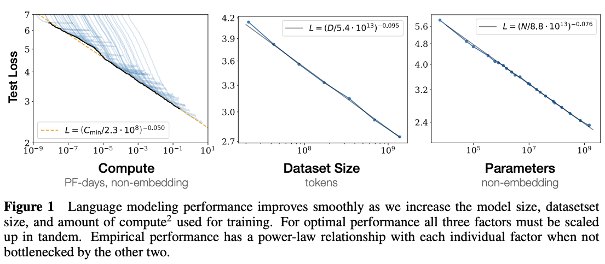
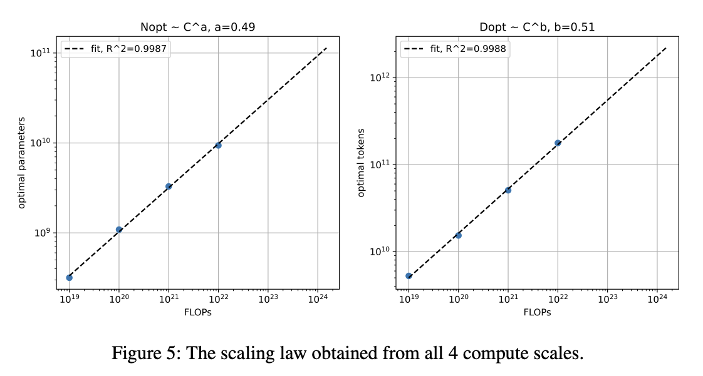

# Scaliing Laws

在Scaling Laws for Neural Language Models论文中，scaling law指的是损失随着模型大小、数据集大小和训练使用的计算量呈幂律变化（图1）。

到了现在，scaling law泛指大模型规模变化的规律，规模可以是模型参数量、数据量、训练时间等等，规律可以是模型表现随模型参数量变化的规律、最佳数据量随模型参数量变化的规律等等。

比如，在Palm2技术报告中，第二节专门记录了scaling law的实验结果。实验表明，当计算量增加时，为了达到最佳效果，模型参数量和和数据量应该等比例增加（图2）。

