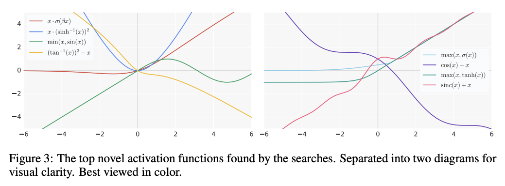

# SwiGLU激活函数

Gated Linear Units由两个线性映射的元素乘组成，其中一个过一道sigmoid函数。用其他激活函数替代sigmoid，就形成了GLU的变种，SwiGLU就是其中一个。SwiGLU替换Transformer FFN中的ReLU，可提升Transformer的训练效果。

## GLU
Gated Linear Units（GLUs）是一种在神经网络中使用的激活机制，旨在提高模型的表达能力和计算效率。GLUs是由Yann Dauphin等人于2016年在论文《Language Modeling with Gated Convolutional Networks》中提出的，最初用于提升语言模型中的卷积神经网络（CNN）的性能。

GLUs利用了门控机制（gating mechanism），类似于LSTM中的门控单元，通过引入额外的门控结构来控制信息的传递。具体的公式如下：

$$
y=(X W+b) \otimes \sigma(X V+c)
$$

其中：
- $X$ 是输入张量。
- $W$ 和 $V$ 是权重矩阵。
- $b$ 和 $c$ 是偏置向量。
- $\sigma$ 是sigmoid激活函数。
- $\otimes$ 表示元素乘。

公式的前半部分是一个线性变换，后半部分是一个门控信号，利用sigmoid函数将其范围压缩到0,1之间。最终的输出是这两个部分的逐元素乘积。

优点：
1. 提高模型表达能力：GLUs通过引入门控机制，允许网络选择性地传递信息，增强了模型的非线性表达能力。
2. 缓解梯度消失问题：由于使用了sigmoid函数，GLUs可以有效缓解梯度消失问题，使得训练更加稳定。
3. 计算效率高：与一些复杂的激活函数相比，GLUs的计算开销较低，适合大规模神经网络的训练。

实现：
```python
import torch
import torch.nn as nn

class GLU(nn.Module):
    def __init__(self, input_dim, output_dim):
        super(GLU, self).__init__()
        self.linear = nn.Linear(input_dim, output_dim)
        self.gate = nn.Linear(input_dim, output_dim)
        
    def forward(self, x):
        return self.linear(x) * torch.sigmoid(self.gate(x))

# 示例使用
input_dim = 10
output_dim = 20
glu = GLU(input_dim, output_dim)
x = torch.randn(5, input_dim)
output = glu(x)
print(output)
```

## Swish
Swish激活函数是一种由谷歌研究团队提出的激活函数，具有以下形式：

$$
\operatorname{Swish}_{\beta}(x)=x \cdot \operatorname{sigmoid}(\beta x)
$$

Swish 激活函数的特点是它的输出不仅仅依赖于输入 $x$ 本身，还受$\sigma(x)$ 的影响，使其在一定程度上保留了输入的信息，同时引入了非线性变换。这种特性使得 Swish 函数在深度神经网络中表现出色，尤其是在处理梯度传播和优化问题时。

Swish 激活函数的优点：
- 平滑性：Swish 是一个平滑的激活函数，没有 ReLU 激活函数的硬拐点，这有助于梯度的稳定传播。
- 自门控机制：Swish 函数通过输入本身进行自门控，允许小负值通过，这对于梯度的流动有利，尤其是深层网络。
- 实验表现：在一些实验中，Swish 激活函数在图像分类和机器翻译等任务上显示出优于 ReLU 和其他传统激活函数的性能。



## Transformer中的SwiGLU
在Transformer中, attention层之后，还要过一层position-wise feed-forward networks。
$$
\operatorname{FFN}(x)=\max \left(0, x W_1+b_1\right) W_2+b_2
$$
其中，$x$是每个位置的向量。这个公式的含义是$x$经过一个线性映射，再经过ReLU，最后再经过另一个线性映射。

SwiGLU替换ReLU之后，FFN则变成：
$$
\operatorname{FFN}_{\text {SwiGLU }}\left(x\right)=\left(\operatorname{Swish}_1(x W) \otimes x V\right) W_2
$$

其中， $\operatorname{Swish}_1$ 意思是 $\beta=1$。公式中省略偏置项。

```python
# 原始FFN
import torch
import torch.nn as nn

class PositionWiseFeedForward(nn.Module):
    def __init__(self, d_model, d_ffn):
        super(PositionWiseFeedForward, self).__init__()
        self.linear1 = nn.Linear(d_model, d_ffn)
        self.relu = nn.ReLU()
        self.linear2 = nn.Linear(d_ffn, d_model)
    
    def forward(self, x):
        return self.linear2(self.relu(self.linear1(x)))

#SwiGLU FFN
class SwiGLUFeedForward(nn.Module):
    def __init__(self, d_model, d_ffn):
        super(SwiGLUFeedForward, self).__init__()
        self.linear1 = nn.Linear(d_model, d_ffn)
        self.linear2 = nn.Linear(d_model, d_ffn)
        self.linear3 = nn.Linear(d_ffn, d_model)
    
    def forward(self, x):
        swish = x * torch.sigmoid(self.linear1(x))
        v = self.linear2(x)
        x = swish * v
        return self.linear3(x)
```


*参考资料*
- [Language Modeling with Gated Convolutional Networks](https://arxiv.org/pdf/1612.08083)
- [SEARCHING FOR ACTIVATION FUNCTIONS](https://arxiv.org/pdf/1710.05941)
- [GLU Variants Improve Transformer](https://arxiv.org/pdf/2002.05202) 