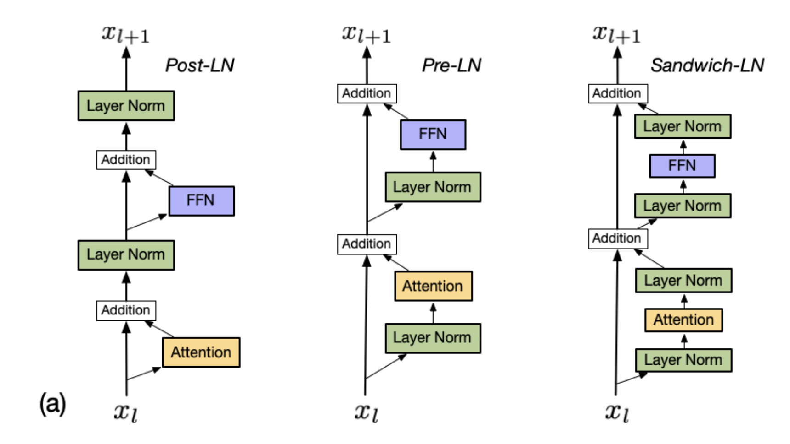
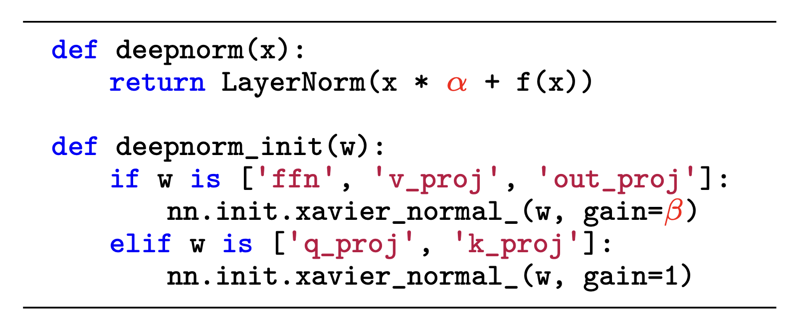

# Normalization

对于预训练LLMs来说，训练不稳定是一个具有挑战性的问题。为了缓解这个问题，Normalization是稳定神经网络训练的一种广泛采用的策略。

## LayerNorm

神经网络层数变多时，会遇到Internal Covariate Shift的问题，指的是每一层的梯度高度依赖于前一层的输出，每一层的参数更新会导致上层的输入数据分布发生变化，通过层层叠加，高层的输入分布变化会非常剧烈，这就使得高层需要不断去重新适应底层的参数更新。

LayerNorm可以缓解Internal Covariate Shift问题，做法是对于每一层的输入，先计算它们的均值和标准差：

$$\mu^{l}=\frac{1}{H} \sum_{i=1}^{H} a_{i}^{l} \quad \sigma^{l}=\sqrt{\frac{1}{H} \sum_{i=1}^{H}\left(a_{i}^{l}-\mu^{l}\right)^{2}}$$

然后每个输入减去均值，除以标准差，再输入到神经网络中。

## 原始Transformer中的LayerNorm

原始Transformer中，MHA和LLN后面加了LayerNorm。

## RMSNorm

RMSNorm仅将输入除以root mean square，可加快神经网络的训练速度。Llama 2使用了RMSNorm。

$$
newa_i=\frac{a_i}{\operatorname{RMS}(\mathbf{a})} g_i, \quad \text { where } \operatorname{RMS}(\mathbf{a})=\sqrt{\frac{1}{n} \sum_{i=1}^n a_i^2} .
$$

## Norm的位置

**Post-LN** 原始Transformer用的就是post-LN。Post-LN不太稳定，所以现在已经很少使用了。
**Pre-LN** pre-LN 是在每个sub-layer之前应用的，最后一个预测层之前也加了个LN。和post-LN相比，pre-LN更稳定，但是效果有所下降。

**Sandwich-LN**  层之前和之后都加LN。

## DeepNorm

DeepNorm形式上很简单，同时具有稳定和表现好的优点，可以将Transformer扩展到1000层。GLM-130B用了DeepNorm。

参考资料

- [A Survey of Large Language Models](https://arxiv.org/abs/2303.18223)
- [Layer Normalization](https://arxiv.org/pdf/1607.06450v1.pdf)
- [详解深度学习中的Normalization，BN/LN/WN](https://zhuanlan.zhihu.com/p/33173246)
- [Root Mean Square Layer Normalization](https://arxiv.org/pdf/1910.07467.pdf)
- [CogView: Mastering Text-to-Image Generation via Transformers](https://arxiv.org/pdf/2105.13290.pdf)
- [DeepNet: Scaling Transformers to 1,000 Layers](https://arxiv.org/pdf/2203.00555.pdf)