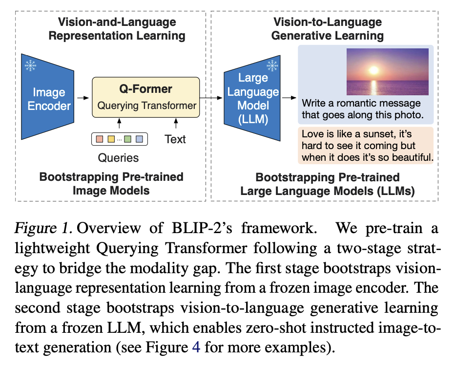
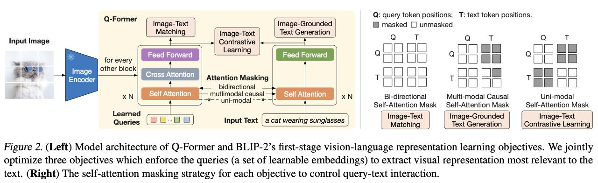
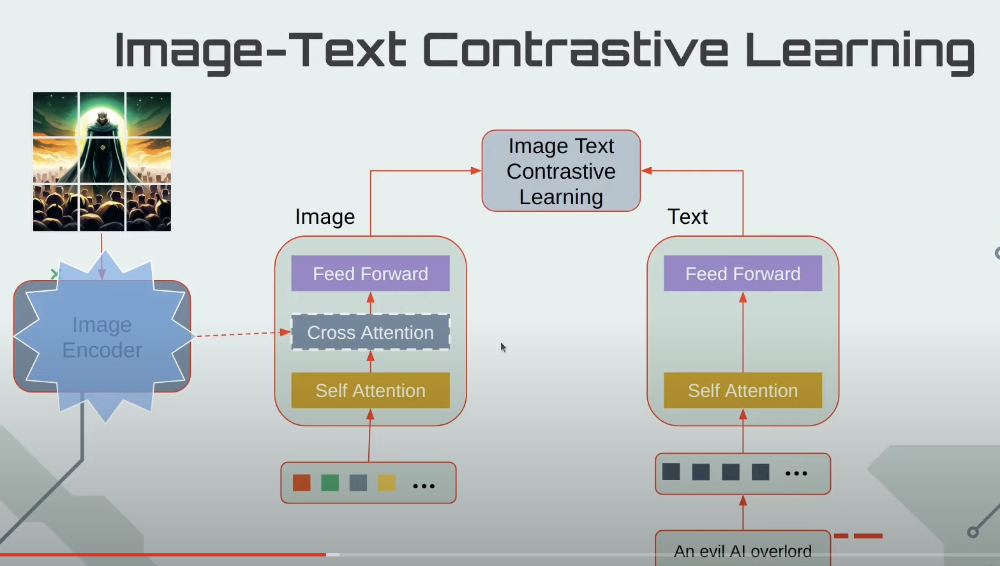
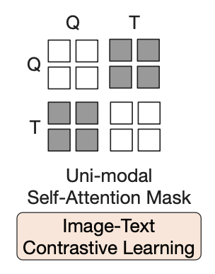
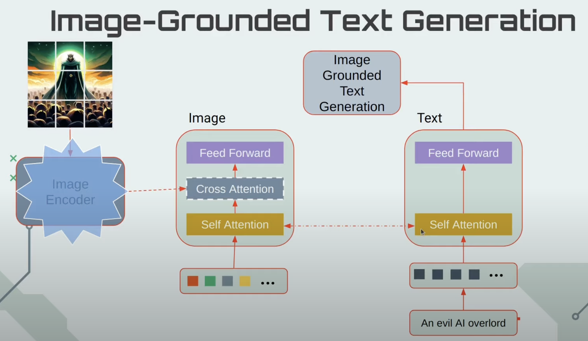
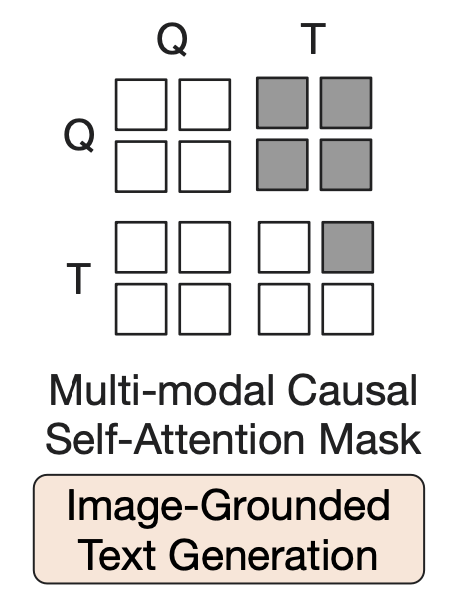
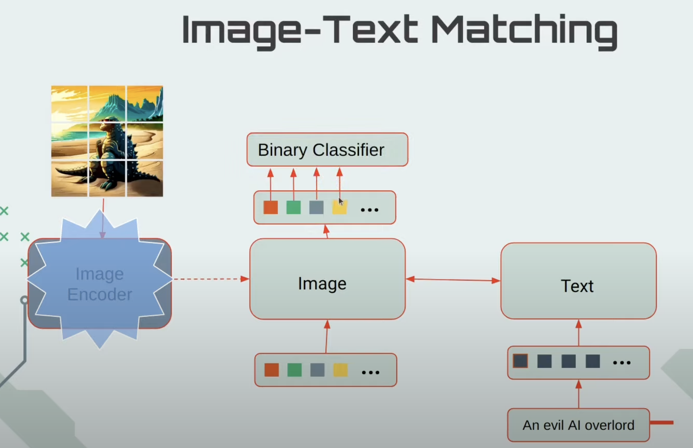
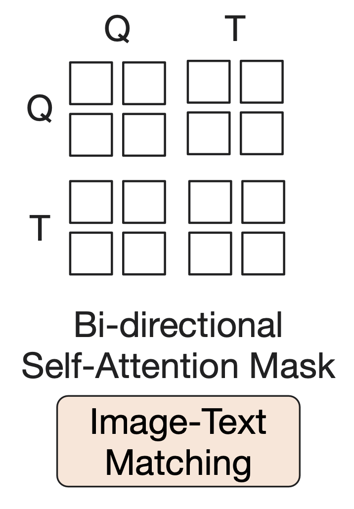
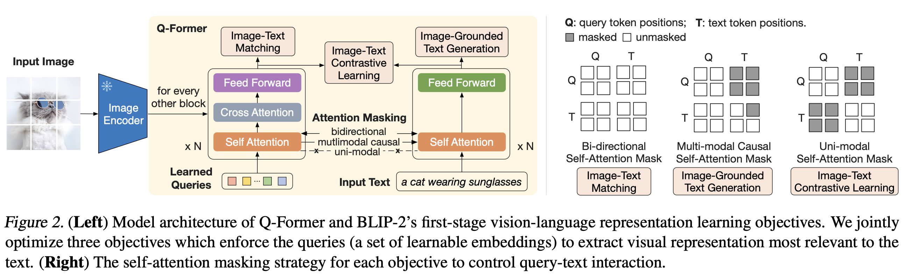
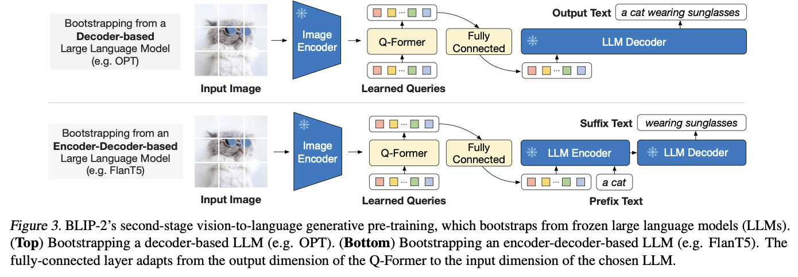

# BLIP-2 Explained 

## BLIP-2概述

BLIP代表Bootstrapping Language-Image Pre-training。在这里，“bootstrap”一词可以理解为“自举”或“引导”的意思。它表示通过某种方法逐步建立或提升系统的能力，而无需从零开始完全重新训练。具体来说，在BLIP-2的框架中，bootstrap的作用是利用已有的预训练模型（如预训练的图像编码器和大型语言模型）来逐步学习和提升视觉-语言表示和生成能力，而不需要从头开始训练整个模型。原文标题很恰如其分，BLIP-2: Bootstrapping Language-Image Pre-training with Frozen Image Encoders and Large Language Models。

BLIP-2训练分为两个阶段：
- 第一阶段：使用冻结的图像编码器来引导视觉-语言表示学习。在这个阶段中，图像编码器的参数是固定的，不会更新，模型通过学习如何利用这些固定的图像表示来进行视觉-语言任务。
- 第二阶段：使用冻结的语言模型来引导视觉到语言的生成学习。在这个阶段，语言模型的参数也是固定的，模型通过学习如何将视觉信息转换为语言表示，并生成符合自然语言指令的文本。



BLIP-2的核心组件是Q-Former，它是一个transformer，用于从图片编码器中提取视觉特征，是图片编码器和LLM之间的桥梁。在第一阶段，Q-Former会学习到和文本最相关的视觉特征。在第二阶段，Q-Former的输出和固定参数的LLM连接起来，使得Q-Former的输出能被LLM理解。

## Stage 1解释

Stage 1: Bootstrap Vision-Language Representation Learning from a Frozen Image Encoder

Stage 1是多任务学习，对应三个损失函数。原文的示意图把三个任务混在一起了，所以不是很好理解，把他们拆开更容易理解。



### Image-Text Contrastive Learning

图文对比学习，让同一个图文对的视觉特征和文本特征尽可能相似。



<p style="text-align:center;">插图来源：https://www.youtube.com/watch?v=k0DAtZCCl1w</p>

Learned queries经过self-attention得到query隐状态，图片经过image encoder得到图片向量，图片向量和query隐状态经过cross attention，得到query output，再经过FFN，得到最终的图片特征。图片特征是一个列表的向量，记为$Z$。

文本经过self attention和FFN，取`[CLS]`的向量，记为$t$。

图文相似度的计算方式：$Z$中的每个向量和$t$计算相似度，取最大的那个。

所谓unimodal self-attention mask，就是图片和文本分别计算self-attention。



这个示意图按行看，阴影是mask，Q是图片的表示，T是文本的表示，图片只能注意图片，文本只能注意文本。

代码解释：

<iframe src="notes/stage1_forward_prepare.html" width="100%" height="600px"></iframe>


### Image-grounded Text Generation



在这个任务中，self attention既是编码器，也是解码器。

attention的视野范围是全部query output(cross attention的输出)，以及已经解码过的token，这就是所谓的multimodal causal self-attention mask。第一个解码token是`[DEC]`。

代码在 https://github.com/salesforce/LAVIS/blob/main/lavis/models/blip2_models/blip2_qformer.py#L249。

`self.Qformer`是`BertLMHeadModel`对象，定义在 https://github.com/salesforce/LAVIS/blob/main/lavis/models/blip2_models/Qformer.py#L968。其中的`past_key_values`参数就是query output（和已经解码过的token），是self attention解码时的key和value。

这个任务的优化目标是语言建模，损失记为`loss_lm`。


这个示意图按行看，阴影是mask，Q是图片的表示，T是文本的表示，图片可以注意所有图片，文本可以注意所有图片和已经解码过的文本。

### Image-Text Matching



明白前两个任务之后，理解第三个任务就比较简单了。

在这个任务中，所有的图片特征和文本特征都可以互相注意，这就是所谓的 bi-directional self-attention mask。



代码在 https://github.com/salesforce/LAVIS/blob/main/lavis/models/blip2_models/blip2_qformer.py#L175 。

代码有很多细微之处，下面是详细解释。

1. **数据准备和收集**：
   
    ```python
    text_input_ids_world = concat_all_gather(text_tokens.input_ids)
    text_attention_mask_world = concat_all_gather(text_tokens.attention_mask)
    image_embeds_world = all_gather_with_grad(image_embeds)
    ```
    
    - `concat_all_gather` 和 `all_gather_with_grad` 用于收集不同设备上的数据，形成全局视角。这里分别收集了文本的 `input_ids`、`attention_mask` 和图像的嵌入。
    
2. **计算相似度矩阵并掩码**：
    ```python
    with torch.no_grad():
        if "image_id" in samples.keys():
            mask = torch.eq(image_ids, image_ids_all.t())
            sim_t2i.masked_fill_(mask, -10000)
            sim_i2t.masked_fill_(mask, -10000)
        else:
            sim_t2i[:, rank * bs : rank * bs + bs].fill_diagonal_(-10000)
            sim_i2t[:, rank * bs : rank * bs + bs].fill_diagonal_(-10000)
    
        weights_t2i = F.softmax(sim_t2i, dim=1)
        weights_i2t = F.softmax(sim_i2t, dim=1)
    ```

    - 这里计算了文本到图像（text-to-image, sim_t2i）和图像到文本（image-to-text, sim_i2t）的相似度矩阵，并对相同ID的对进行掩码处理，以防止模型在负采样时选择相同的对。
    - 随后对相似度矩阵应用 softmax，以获得每个文本对应不同图像的权重分布 `weights_t2i`，以及每个图像对应不同文本的权重分布 `weights_i2t`。

3. **选择负样本**：
    ```python
    image_embeds_neg = []
    for b in range(bs):
        neg_idx = torch.multinomial(weights_t2i[b], 1).item()
        image_embeds_neg.append(image_embeds_world[neg_idx])
    image_embeds_neg = torch.stack(image_embeds_neg, dim=0)
    
    text_ids_neg = []
    text_atts_neg = []
    for b in range(bs):
        neg_idx = torch.multinomial(weights_i2t[b], 1).item()
        text_ids_neg.append(text_input_ids_world[neg_idx])
        text_atts_neg.append(text_attention_mask_world[neg_idx])
    
    text_ids_neg = torch.stack(text_ids_neg, dim=0)
    text_atts_neg = torch.stack(text_atts_neg, dim=0)
    ```
    - 这部分代码根据权重分布 `weights_t2i` 和 `weights_i2t` 为每个正样本选择一个负样本。具体做法是通过 `torch.multinomial` 从权重分布中采样负样本的索引，然后将这些负样本的嵌入（图像和文本）收集起来。
    - 通过 torch.multinomial 函数从这个分布中采样，可以有效地选择那些与当前文本（或图像）具有高相似度但实际并不匹配的负样本。这样就实现了hard negative mining，即选择那些难以区分的负样本来训练模型。

4. **准备输入数据**：
    ```python
    text_ids_all = torch.cat([text_tokens.input_ids, text_tokens.input_ids, text_ids_neg], dim=0)
    text_atts_all = torch.cat([text_tokens.attention_mask, text_tokens.attention_mask, text_atts_neg], dim=0)
    
    query_tokens_itm = self.query_tokens.expand(text_ids_all.shape[0], -1, -1)
    query_atts_itm = torch.ones(query_tokens_itm.size()[:-1], dtype=torch.long).to(image.device)
    attention_mask_all = torch.cat([query_atts_itm, text_atts_all], dim=1)
    
    image_embeds_all = torch.cat([image_embeds, image_embeds_neg, image_embeds], dim=0)
    image_atts_all = torch.ones(image_embeds_all.size()[:-1], dtype=torch.long).to(image.device)
    ```

    - 将正样本和负样本的文本和图像拼接在一起，形成模型的输入。`text_ids_all` 和 `text_atts_all` 分别包含了正样本文本、正样本文本和负样本文本的 `input_ids` 和 `attention_mask`。
    - `query_tokens_itm` 是用于ITM任务的查询标记，它们与文本和图像的嵌入一起输入模型。`attention_mask_all` 是拼接后的注意力掩码。
    - `image_embeds_all` 是包含正样本图像、负样本图像和正样本图像的嵌入。`image_atts_all` 是对应的注意力掩码。

5. **模型前向传播**：
    ```python
    output_itm = self.Qformer.bert(
        text_ids_all,
        query_embeds=query_tokens_itm,
        attention_mask=attention_mask_all,
        encoder_hidden_states=image_embeds_all,
        encoder_attention_mask=image_atts_all,
        return_dict=True,
    )
    ```


6. **计算匹配分数和损失**：
    ```python
    vl_embeddings = output_itm.last_hidden_state[:, : query_tokens_itm.size(1), :]
    vl_output = self.itm_head(vl_embeddings)
    logits = vl_output.mean(dim=1)
    
    itm_labels = torch.cat([torch.ones(bs, dtype=torch.long), torch.zeros(2 * bs, dtype=torch.long)], dim=0).to(image.device)
    loss_itm = F.cross_entropy(logits, itm_labels)
    ```

    - 提取出最后一层隐藏状态的查询嵌入，并通过线性分类器 `itm_head` 计算每个查询嵌入的logits。
    - 对所有查询嵌入的logits求平均，作为输出的匹配分数。
    - 制作标签 `itm_labels`，正样本为1，负样本为0。计算交叉熵损失 `loss_itm`。
    ```

最后得到损失，记为loss_itm。

第一阶段的训练，最终的损失是三个任务的损失之和，代码在 https://github.com/salesforce/LAVIS/blob/main/lavis/models/blip2_models/blip2_qformer.py#L271 。

### 回顾

现在在看原论文中的示意图，就好理解了。


再理解几个原文中的句子：

> 原文：Q-Former consists of two transformer submodules that share the same self-attention layers: (1) an image transformer that interacts with the frozen image encoder for visual feature extraction, (2) a text transformer that can function as both a text encoder and a text decoder. 

解释：这个说法有点误导。在实现上，其实只有一个transformer(更具体的，初始化为bert-base-uncased)，这个transformer有时候输入是文本，有时候输入是图片向量+learned queries。有时候只用self attention，有时候也用cross attention。


> 原文：We create a set number of learnable query embeddings as input to the image transformer. The queries interact with each other through self-attention layers, and interact with frozen image features through cross-attention layers (inserted every other transformer block). 

解释：Q-Former有N个block层，每个block层有一个self attention层和一个cross attention层。提取图片特征时，在每个block层，先用self attention计算queies的隐状态，再结合cross attention计算视觉特征。这就是所谓的inserted every other transformer block。这种安排可以在保留queries自我交互的同时，定期引入图像特征信息，平衡两者之间的信息流。


> 原文：The queries can additionally interact with the text through the same self-attention layers.

解释：因为他们共用一个self attention，所以就间接交互了。


> 原文： Depending on the pre-training task, we apply different self-attention masks to control query-text interaction. We initialize Q-Former with the pre-trained weights of BERTbase (Devlin et al., 2019), whereas the cross-attention layers are randomly initialized. In total, Q-Former contains 188M parameters. Note that the queries are considered as model parameters.

解释：we apply different self-attention masks to control query-text interaction这句话是重中之重，是理解Q-Former实现的关键。


## Stage 2解释

Stage 2: Bootstrap Vision-to-Language Generative Learning from a Frozen LLM

这个阶段就比较简单了，没什么可说的。


OPT的代码在 https://github.com/salesforce/LAVIS/blob/main/lavis/models/blip2_models/blip2_opt.py#L107。


## 代码详细解释
### Qformer代码
#### BertSelfAttention
代码位置: https://github.com/salesforce/LAVIS/blob/main/lavis/models/blip2_models/Qformer.py#L111

init参数:
```python
config：包含了注意力机制的配置参数，例如隐藏层大小、注意力头的数量等。
is_cross_attention：一个布尔值，表示是否是跨注意力（cross-attention）机制，即查询（query）和键值（key-value）来自不同的输入。
```

config在这里设置：https://github.com/salesforce/LAVIS/blob/ac8fc98c93c02e2dfb727e24a361c4c309c8dbbc/lavis/models/blip2_models/blip2.py#L48

具体config文件是：https://huggingface.co/google-bert/bert-base-uncased/blob/main/config.json

根据是否is_cross_attention，K和V的输入维度有所不同。如果is_cross_attention==True，输入维度是Image Encoder的维度，在 https://github.com/salesforce/LAVIS/blob/ac8fc98c93c02e2dfb727e24a361c4c309c8dbbc/lavis/models/blip2_models/blip2.py#L47 配置。vision_width就是图片编码器的维度，在 https://github.com/salesforce/LAVIS/blob/ac8fc98c93c02e2dfb727e24a361c4c309c8dbbc/lavis/models/blip2_models/blip2_qformer.py#L71 配置，源头在 https://github.com/salesforce/LAVIS/blob/ac8fc98c93c02e2dfb727e24a361c4c309c8dbbc/lavis/models/eva_vit.py#L257 。

forward时，根据是否有encoder_hidden_states来赋值is_cross_attention。如果cross，k和v从encoder_hidden_states计算；否则，从hidden_states计算。

past_key_value只在解码的时候才有，实现KVcache。经过 transpose_for_scores 处理后，key_layer和value_layer的形状通常是 (batch_size, num_attention_heads, seq_length, attention_head_size)，所以dim=2就是在时间维度上的拼接。

`attention_scores = attention_scores + attention_mask`是pointwise操作，有mask的位置会变成一个非常小的数，softmax之后权重就接近0。

context_layer是注意力的最终输出，形状是(batch_size, seq_length, all_head_size)。

forward输出元组，(context_layer, past_key_value)。

#### BertLayer
代码位置： https://github.com/salesforce/LAVIS/blob/main/lavis/models/blip2_models/Qformer.py#L378

`chunk_size_feed_forward`定义在 https://huggingface.co/docs/transformers/main_classes/configuration , bert-base-uncased没有配置，则默认为0. The chunk size of all feed forward layers in the residual attention blocks. A chunk size of 0 means that the feed forward layer is not chunked. A chunk size of n means that the feed forward layer processes n < sequence_length embeddings at a time. 处理长序列输入时，内存占用可能非常高。通过分块处理，可以将输入序列分成若干个小块，每次只处理一个小块，从而减少单次计算所需的内存量。

self.seq_len_dim = 1 表示序列长度在shape中的索引是1.

cross_attention_freq 设置每隔多少层会插入一个交叉注意力层，在 https://github.com/salesforce/LAVIS/blob/ac8fc98c93c02e2dfb727e24a361c4c309c8dbbc/lavis/models/blip2_models/blip2.py#L47 中设置为2。

BertIntermediate 是 BERT 模型中的一个中间层组件，被用于实现前馈网络（Feed-Forward Network, FFN）的第一部分。前馈网络是 Transformer 架构中的一个关键组件，它通常包含两个线性变换（全连接层）和一个激活函数。
在 Transformer 架构中，一个典型的前馈网络由两个线性层和一个激活函数组成：
1. **第一部分（BertIntermediate）**：
    - 输入维度为 `hidden_size`。
    - 通过线性层变换到 `intermediate_size`。
    - 应用激活函数。
2. **第二部分（BertOutput）**：
    - 输入维度为 `intermediate_size`。
    - 通过线性层变换回 `hidden_size`。
    - 进行残差连接和层归一化（Layer Normalization）。


query_length是learned queries的数量，在 https://github.com/salesforce/LAVIS/blob/ac8fc98c93c02e2dfb727e24a361c4c309c8dbbc/lavis/models/blip2_models/blip2_qformer.py#L71 中默认设置为num_query_token=32. 根据num_query_token数量，声明query tokens权重矩阵， https://github.com/salesforce/LAVIS/blob/ac8fc98c93c02e2dfb727e24a361c4c309c8dbbc/lavis/models/blip2_models/blip2.py#L57 

#### BertEncoder
代码在 https://github.com/salesforce/LAVIS/blob/main/lavis/models/blip2_models/Qformer.py#L487 

这个类没什么需要特别解释的，输入一层一层经过BertLayer。

虽然在示意图中好像有两个encoder，其实在实现上其实只有一个，对应所谓的"share the same self-attention layers"。

#### BertEmbeddings
https://github.com/salesforce/LAVIS/blob/main/lavis/models/blip2_models/Qformer.py#L51

这是attention前面的层，将输入转换成attention接收的向量。

注意这个计算逻辑:
```python
 def forward(
        self,
        input_ids=None,
        position_ids=None,
        query_embeds=None,
        past_key_values_length=0,
    ):
        # ...
        if input_ids is not None:
            embeddings = self.word_embeddings(input_ids)
            # ...
            if query_embeds is not None:
                embeddings = torch.cat((query_embeds, embeddings), dim=1)
        else:
            embeddings = query_embeds

```


#### BertModel
https://github.com/salesforce/LAVIS/blob/main/lavis/models/blip2_models/Qformer.py#L677 

比BertEncoder多了个输入embedding层。

重点是get_extended_attention_mask这个方法。

<iframe src="notes/get_extended_attention_mask.html" width="100%" height="600px"></iframe>

#### BertLMHeadModel
https://github.com/salesforce/LAVIS/blob/main/lavis/models/blip2_models/Qformer.py#L968

这是qFormer的核心组件。blip.Qformer变量就是BertLMHeadModel对象。

这个类执行语言建模。LM代表语言模型，Head表示这个类实现了一个特定的头部。头部通常指代模型的最后一层或几层，它们负责将模型的编码器输出转换为特定的任务输出。对于语言模型，头部通常包括一个线性层和一个softmax层，用于预测词汇表中的下一个词。`self.cls = BertOnlyMLMHead(config)`做的就是预测下一个词。

继承BertPreTrainedModel的作用：使用基类中定义的初始化方法，初始化参数为预训练BERT权重。

### Stage 1训练代码
运行命令： https://github.com/salesforce/LAVIS/blob/main/run_scripts/blip2/train/pretrain_stage1.sh

#### 配置文件pretrain_stage1.yaml
https://github.com/salesforce/LAVIS/blob/ac8fc98c93c02e2dfb727e24a361c4c309c8dbbc/lavis/projects/blip2/train/pretrain_stage1.yaml

全部训练配置都在这里设置。

<iframe src="notes/pretrain_stage1.html" width="100%" height="600px"></iframe>

#### Blip2Qformer
https://github.com/salesforce/LAVIS/blob/ac8fc98c93c02e2dfb727e24a361c4c309c8dbbc/lavis/models/blip2_models/blip2_qformer.py#L25

这是训练stage1的核心，数据进入Blip2Qformer类，输出损失。

三个损失函数前面已经分析过。

#### ImageTextPretrainTask 和 BaseTask
训练代码在这里定义。

https://github.com/salesforce/LAVIS/blob/ac8fc98c93c02e2dfb727e24a361c4c309c8dbbc/lavis/tasks/base_task.py

#### RunnerBase
前面是定义模型、数据、任务，在这里开始训练。

https://github.com/salesforce/LAVIS/blob/main/lavis/runners/runner_base.py

train方法执行训练循环。train_epoch方法训练一个epoch，它再调用task类的train_epoch方法，进行实际的训练一轮。

_save_checkpoint解释：
<iframe src="notes/save_checkpoint.html" width="100%" height="600px"></iframe>

### Stage 2训练代码
运行命令： https://github.com/salesforce/LAVIS/blob/main/run_scripts/blip2/train/pretrain_stage2.sh

#### 配置文件pretrain_stage2.yaml

https://github.com/salesforce/LAVIS/blob/ac8fc98c93c02e2dfb727e24a361c4c309c8dbbc/lavis/projects/blip2/train/pretrain_stage2.yaml

```yml
model:
  arch: blip2_opt
  model_type: pretrain_opt2.7b 
  load_pretrained: True
  # intialize stage 2 pretraining from stage 1 pretrained model
  pretrained: "https://storage.googleapis.com/sfr-vision-language-research/LAVIS/models/BLIP2/blip2_pretrained.pth"
  freeze_vit: True
```

模型是blip2_opt

#### Blip2OPT

https://github.com/salesforce/LAVIS/blob/ac8fc98c93c02e2dfb727e24a361c4c309c8dbbc/lavis/models/blip2_models/blip2_opt.py#L21 

这个类包含qFormer和OPT，forward时计算语言模型损失。


