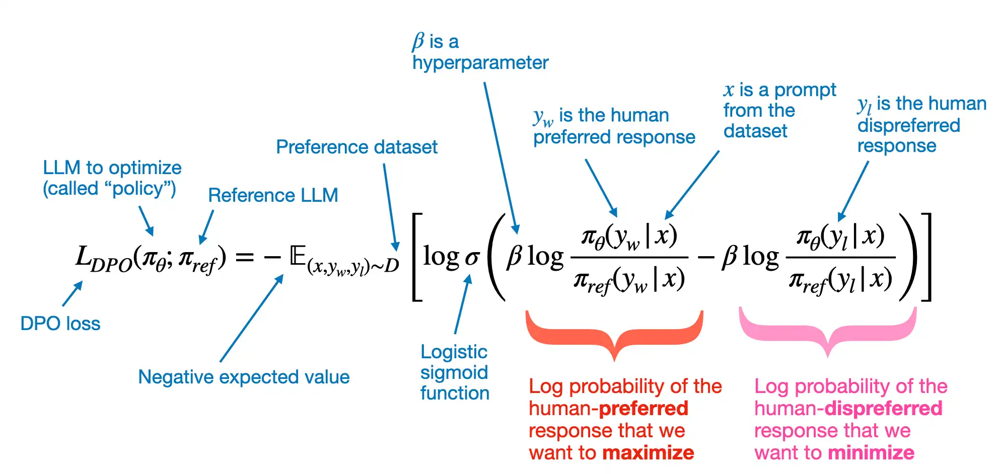

# DPO

The core DPO equation is shown again below:

其中：
- "expected value" is statistics jargon and stands for the average or mean value of the random variable (the expression inside the brackets)
- The variable $\pi_{\theta}$ is the so-called policy and represents the LLM we want to optimize; $\pi_{\text{ref}}$ is a reference LLM, which is typically the original LLM before optimization (at the beginning of the training, $\pi$ and $\pi_{\text{ref}}$ are typically the same).
-  $\beta$ is a hyperparameter to control the divergence between the $\pi_{\theta}$ and the reference model; increasing $\beta$ increases the impact of the difference between $\pi_{\theta}$ and $\pi_{\text{ref}}$ in terms of their log probabilities on the overall loss function, thereby increasing the divergence between the two models.

[参考](https://github.com/rasbt/LLMs-from-scratch/blob/main/ch07/04_preference-tuning-with-dpo/dpo-from-scratch.ipynb) 