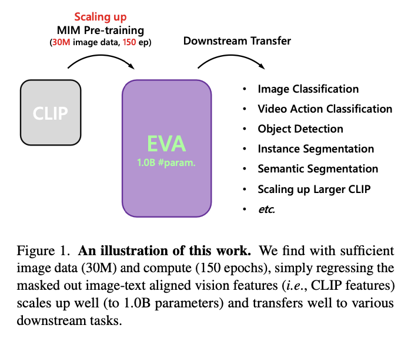
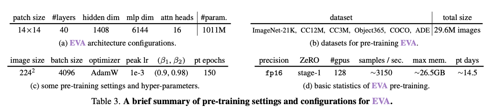

# EVA

In this work, we launch EVA, a one billion parameters vanilla ViT encoder to explore the limits of masked visual representation learning.

## EVA预训练
EVA是一个预训练模型，只通过[MIM](mim.md)训练。训练配置如下：

预训练目标：随机mask 40%的patch。在mask上，CLIP-L/14的预测作为标记，和eva的预测做余弦相似度。目标是最大化余弦相似度。因为CLIP-L/14本身自带图文对齐，所以EVA预训练完之后，也间接学习了图文对齐。

