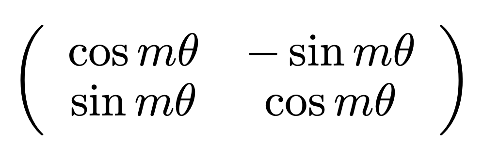
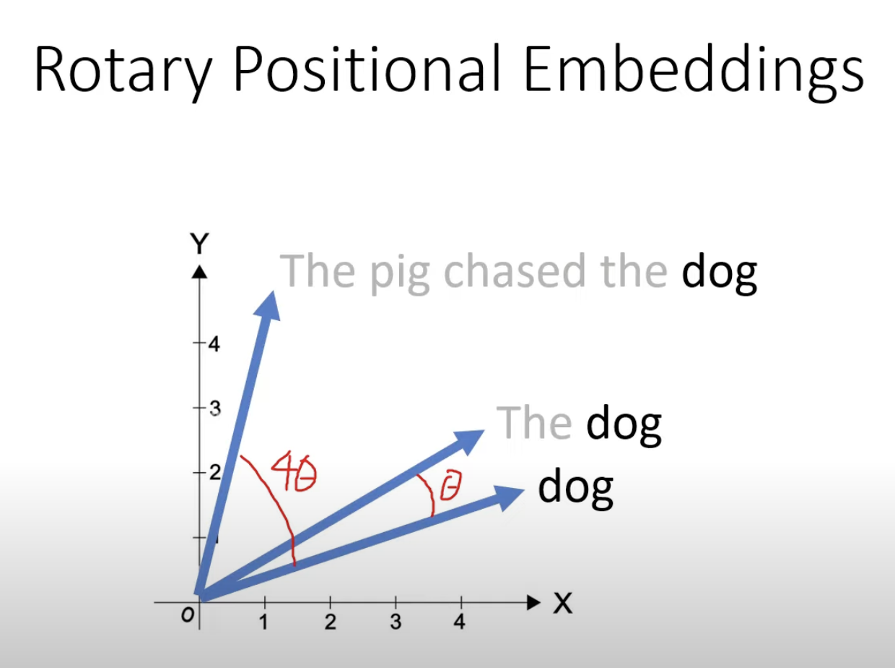
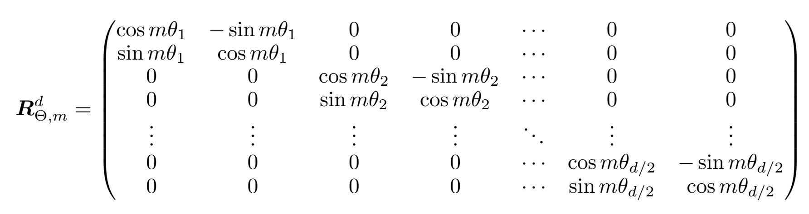
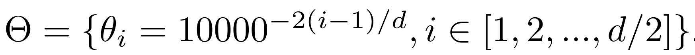
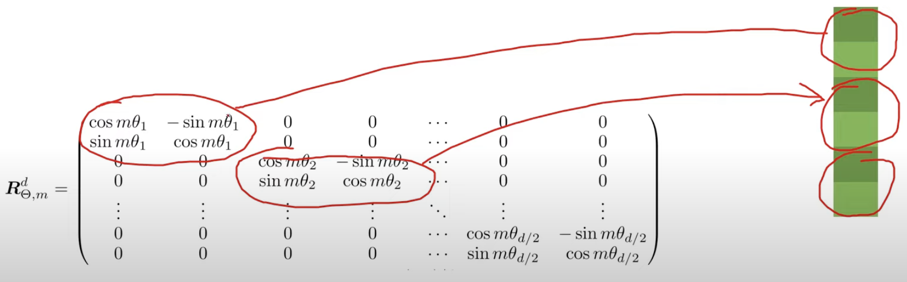
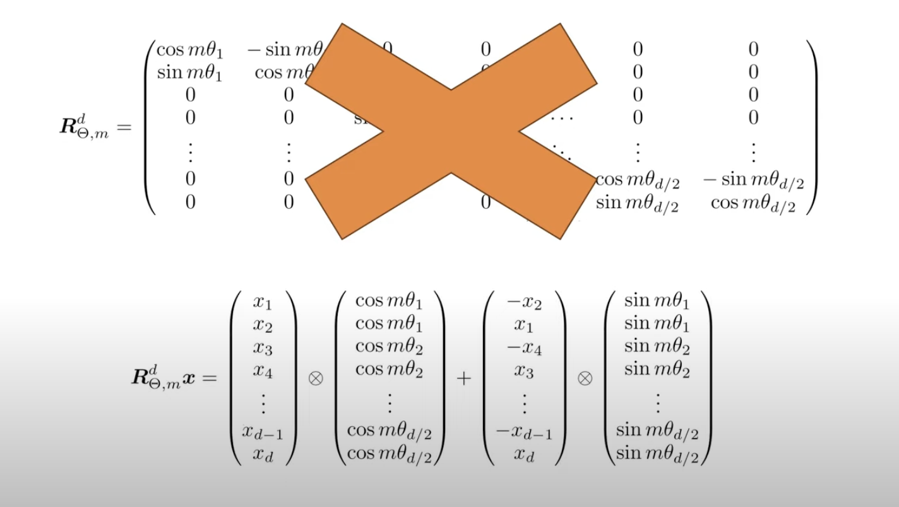
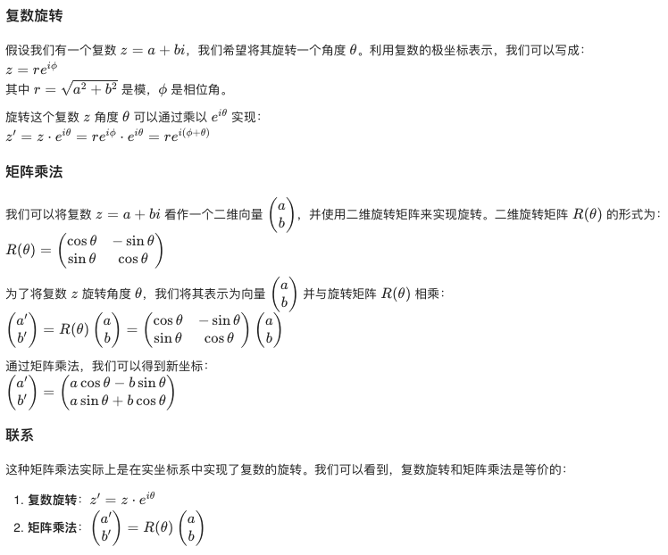

# RoPE Explained

## 原理
RoPE的出发点是“通过绝对位置编码的方式实现相对位置编码”。

原论文有很多公式，目的是找到一组满足这样关系的函数：

$$
\left\langle f_q\left(\boldsymbol{x}_m, m\right), f_k\left(\boldsymbol{x}_n, n\right)\right\rangle=g\left(\boldsymbol{x}_m, \boldsymbol{x}_n, m-n\right) . 
$$

意思是，位于m位置的q向量和位于n位置k向量，施加了“位置作用”之后得到的新向量的点积，只和这两个向量以及它们的相对位置有关。

原论文证明，在二维情况下，这个位置作用可以表示为旋转矩阵：

这个矩阵将二维向量逆时针旋转 $\theta$ 度：

进一步，多维情况的矩阵是：

其中

 

这个矩阵对输入向量依次两两维度进行旋转操作（所以最多 $d/2$ 个操作）：

 

## 实现
实现不需要声明巨大的矩阵，也不需要作矩阵乘法，因为原矩阵乘法相当于向量的乘机和求和：

 

下面是[llama3](https://github.com/meta-llama/llama-models/blob/main/models/llama3_1/api/model.py)中rope的实现：

<iframe src="notes/rope_imp.html" width="100%" height="600px"></iframe>

## 优点
RoPE的优良性质有：
- 序列长度灵活。能有效处理不同长度的输入。
- 远程衰减。两个qk的相对位置越远，计算attention时的权重越小。
- 可以拓展到线性attention（用得少）。

## 附录：复数和旋转相关概念
**复数**

复数是形如 $a+b i$ 的数, 其中 $a$ 和 $b$ 是实数, $i$ 是虚数单位, 满足 $i^2=-1$ 。复数可以表示为一个二维平面上的点或向量, 这个平面称为复平面, 其中 $x$ 轴表示实数部分, $y$ 轴表示虚数部分。

**极坐标**

复数也可以用极坐标表示。极坐标形式表示一个点的距离（模）和角度（幅角）：

- 模（或幅度）$r$ ：复数从原点到该点的距离，计算公式为 $r = \sqrt{a^2 + b^2}$。
- 幅角（或相位）$\theta$：从正实轴到该点的角度，计算公式为 $\theta = \tan^{-1}(b / a)$ ，需要注意象限。

因此，一个复数 $z$ 在极坐标下可以表示为 $z = r (\cos \theta + i \sin \theta)$，或者更常用的形式 $z = re^{i\theta}$ 。欧拉公式 $e^{i\theta} = \cos \theta + i \sin \theta $ 连接了指数函数和三角函数，是复数极坐标表示的基础。

**复数乘法和旋转的关系**

复数乘法可以视为在复平面上进行旋转和缩放的操作。

假设我们有两个复数 $z_1 = r_1 e^{i\theta_1}$ 和 $z_2 = r_2 e^{i\theta_2}$。

复数的乘法定义为：
$$
z_1 \cdot z_2 = (r_1 e^{i\theta_1}) \cdot (r_2 e^{i\theta_2})
$$ 

根据指数的性质，这相当于：
$$
z_1 \cdot z_2 = r_1 r_2 e^{i(\theta_1 + \theta_2)}
$$

从几何角度来看，这意味着：
- 模的相乘：结果复数的模是两个复数模的乘积。
- 相位角的相加：结果复数的相位角是两个复数相位角的和。

这正是旋转和缩放的几何意义：
- 缩放：模的乘积 $r_1 r_2$ 表示结果复数在复平面上距离原点的距离。通过乘法，复数的模会被缩放。
- 旋转：相位角的和 $\theta_1 + \theta_2$ 表示结果复数在复平面上的旋转角度。通过乘法，复数的相位角会被旋转。

**矩阵乘法表示的复数旋转**

*参考资料*
- [ROFORMER: ENHANCED TRANSFORMER WITH ROTARY POSITION EMBEDDING](https://arxiv.org/pdf/2104.09864)
- [Rotary Positional Embeddings: Combining Absolute and Relative](https://www.youtube.com/watch?v=o29P0Kpobz0&t=530s)

