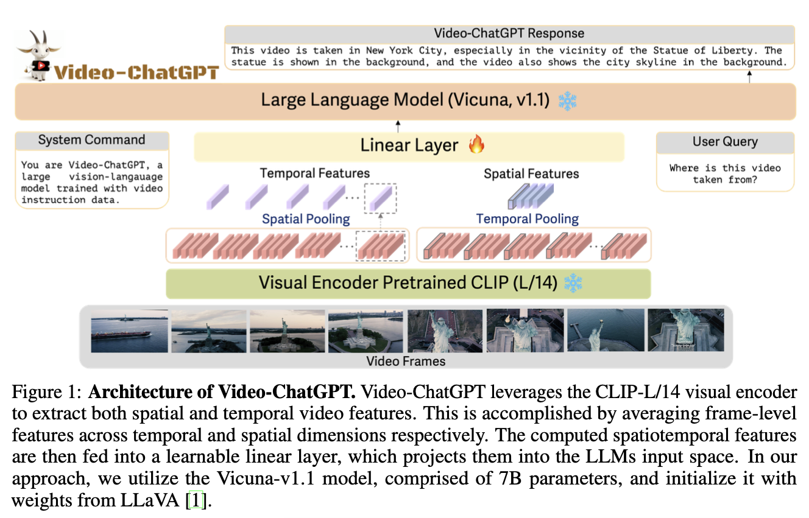

# Video-ChatGPT结构

Visual encoder用的是CLIP ViT-L/14。
给定一个视频 $V_i \in \mathbb{R}^{T \times H \times W \times C}$ ，其中，$T$ 是帧数，$H$ 是高度， $W$是宽度，$C$ 是channel数量。
用visual encoder对这些帧进行批计算，得到 $x_i \in \mathbb{R}^{T \times h \times w \times D}$ ，其中$h=H / p, w=W / p$，$p$是patch size。token的数量记为 $N=h \times w$。

Frame-level embeddings are average-pooled along the temporal dimension to obtain a video-level temporal representation $t_i \in \mathbb{R}^{N \times D}$. This operation, referred to as temporal pooling, implicitly incorporates temporal learning through the aggregation of multiple frames. 这个操作具体是这样的：首先将$x_i$的 $h \times w$ 进行拼接，得到 $T \times N \times D$；然后，在$T$维度上取平均，得到$N \times D$。

Similarly, the frame-level embeddings are average-pooled along the spatial dimension to yield the video-level spatial representation $z_i \in \mathbb{R}^{T \times D}$. The temporal and spatial features are concatenated to obtain the video-level features $v_i$,
$$
v_i=\left[\begin{array}{ll}t_i & z_i\end{array}\right] \in \mathbb{R}^{(T+N) \times D}
$$
注意，如果视频很短或帧率很小，N可能远大于T。

A simple trainable linear layer $g$, projects these video-level features into the language decoder's embedding space, transforming them into corresponding language embedding tokens $Q_v$,
$$
Q_v=g\left(v_i\right) \in \mathbb{R}^{(T+N) \times K} .
$$
其中，$K$ 是llm的token向量的维度。

