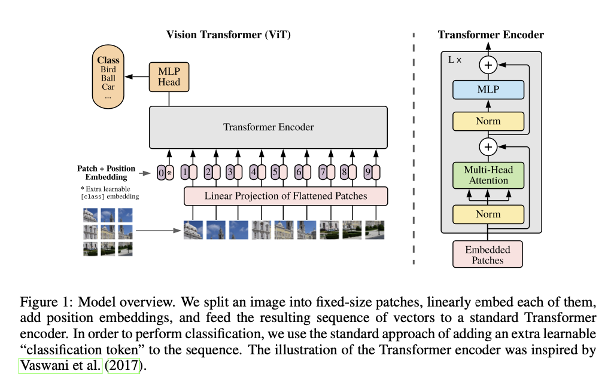

# ViT

To perform classification, a standard approach is to prepend an extra learnable embedding “classification token” [CLASS] to the sequence of embedded patche
$$
\mathbf{Z} \leftarrow \operatorname{concat}([\mathrm{CLASS}], \mathbf{X W})
$$

原论文：https://arxiv.org/abs/2010.11929